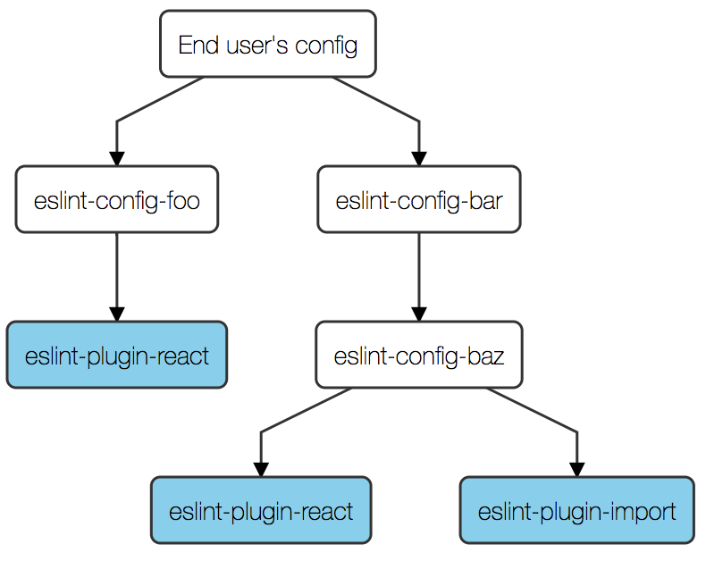

- Start Date: 2018-12-03
- RFC PR: (leave this empty, to be filled in later)
- Authors: Teddy Katz ([@not-an-aardvark](https://github.com/not-an-aardvark))

# Load configs and plugins relative to where they're referenced

## Summary

This feature would update ESLint to load plugins and shareable configs relative to the location of the config files where they're referenced, rather than relative to the location of the running ESLint instance. As a result, configs would be able to specify plugins as their own dependencies, and ESLint users would see fewer confusing errors about missing plugins.

## Motivation

Currently, ESLint plugins and shareable configs are loaded from the location of the ESLint package, rather than the location of the config file where the plugins and configs are referenced. This leads to several problems:

* The current behavior requires end users to manually install any plugins required by a shareable config. As a result, a shareable config can't add a plugin without requiring new manual installation steps from the end user. This greatly decreases the ergonomics of using custom rules from plugins in shareable configs, and results in increased pressure to add new rules and options to ESLint core.
* The current behavior assumes that if a user installs a config/plugin and ESLint in the same project, then ESLint will be able to load that config/plugin. This relies on an implementation detail of how npm works rather than a specified behavior, which leads to problems when using other package management strategies, e.g. with `lerna`. (More details about this problem can be found in [eslint/eslint#10125](https://github.com/eslint/eslint/issues/10125).) It also creates problems when using ESLint as a non-top-level dependency with package management strategies that strictly enforce dependency validity with Yarn Plug 'n Play.
* The current behavior leads to a large amount of confusion from users where ESLint behaves differently depending on whether it's installed "globally" with npm.

A separate but related facet of ESLint's design currently requires plugin names to be globally unique, leading to some additional problems:

* If two shareable configs depend on two different versions of the same plugin, the configs are entirely incompatible and can't be used together.
* It's difficult to create features that load plugins from other locations (e.g. as proposed in [eslint/eslint#6237](https://github.com/eslint/eslint/issues/6237)), because the name of a plugin loaded from another location might conflict with the name of a plugin in `node_modules`.

### Design goals of solution

* A config author should be able to add or upgrade any plugin in their config, without requiring additional installation steps from end users that extend that config.
* The end user should maintain the ability to override any configuration setting inherited from an extended config.
* A config author should be able to extend any two other configs at the same time, and have ESLint lint their code successfully. (The two configs might advocate mutually-incompatible code styles, but that issue is out of scope for this proposal.)
* ESLint's config-loading behavior should be compatible with the use of any package manager that follows the de-facto `package.json` spec, without relying on the implementation details of any particular package manager.
* Standalone config files should continue to be usable as shareable configs, and vice versa, without any changes.
* Shareable configs which currently have plugins as `peerDependencies` should be able to transition to the new solution without requiring changes to the configs of their users (or at least the vast majority of their users).
* The vast majority of existing configs in local-installation setups should continue to work with the new solution.

## Detailed Design

ESLint should resolve shareable configs and plugins relative to the config file that loads them. In other words, if a config file specifies `extends: ["foo"]` or `plugins: ["bar"]`, then the appropriate shareable config will be resolved in the same manner as if `require("eslint-config-foo")` or `require("eslint-plugin-bar")` had been called from the same location as that config file.

This change creates some complications in certain corner cases. These complications, and a proposed solution for them, are described below.

### The duplicate-plugin problem

Implementing this scheme as-is would cause naming ambiguity when referring to rules. For example, there could be two shareable configs which have dependencies on two different plugins that both happen to be called `react` (or they depend on two different versions of a plugin called `react`). If the end user depended on these two shareable configs and also configured a rule like `react/some-rule` in their top-level config, the end user's config would be ambiguous because it wouldn't be clear which `react` plugin they were referring to. Since the configurations for a given rule might be incompatible across different versions of a plugin, this could make it impossible to set the configuration for a particular rule or to override a configuration which was set by a shareable config. This would be an unacceptably poor user experience.

Another way to state the problem is that ESLint's mechanism for naming rules in a config file (`plugin-name/rule-name`) is fundamentally unable to disambiguate two plugins that have the same name. Currently, there are no naming conflicts because all plugins are loaded from the location of the `eslint` package, so plugins effectively live in a global namespace. If plugins could be loaded as dependencies of shareable configs, as implied by this proposal, then naming conflicts would start to become a problem.

Note: The name ambiguity problem applies to all named resources provided by a plugin. This includes rules and environments, and will also include other resources such as processors if [RFC #3](https://github.com/eslint/rfcs/pull/3) is approved. For brevity, the rest of this RFC only refers to rule naming, but the same solution will also be used to name other plugin-provided resources.

### Solving the duplicate-plugin problem

Since the problem stems from a limitation of ESLint's naming scheme, the most straightforward solution to the problem would involve changing the way that rules are named in a config file. Specifically, rules will now be addressed with hierarchical naming for rules, where rules can be configured with something that looks like a path. (In other words, a user could refer to a rule like `foo::react/some-rule` for the version of `eslint-plugin-react` used by `eslint-config-foo`, and this would be a different rule than `bar::react/some-rule`, which would refer to the version of `eslint-plugin-react` used by `eslint-config-bar`.) To preserve compatibility, the existing naming scheme `react/some-rule` would continue to work in cases where the reference is unambiguous.

The following sections describe the specifics of how hierarchical naming works.

#### Config trees

When describing how rule name resolution works in this proposal, it's useful to think of a "config tree" representing the dependencies between shareable configs and plugins. The root node is the end user's config, and each node has a set of named children representing the shareable configs that it extends and plugins that it depends on. Here's an example tree:



In this example, the end user's config extends `eslint-config-foo` and `eslint-config-bar`. `eslint-config-bar` extends `eslint-config-baz`. `eslint-config-foo` and `eslint-config-baz` both depend on versions of `eslint-plugin-react` (perhaps different versions, although this doesn't matter as far as resolution is concerned). `eslint-config-baz` also depends on `eslint-plugin-import`.

In detail, a config is said to depend on a given shareable config if it's listed in the `extends` section. A config is said to depend on a given plugin if either (a) it's listed in the `plugins` section, or (b) one of the plugin's configs is listed in the `extends` section.

#### Details of hierarchical rule name resolution

* Each reference to a plugin rule in a config consists of three parts: a *config scope* (i.e. a list of configs), a plugin name, and a rule name.
    * For example, in an existing rule configuration like `react/no-typos`, the config scope is an empty list, the plugin name is `react`, and the rule name is `no-typos`. (In existing rule configurations, the config scope is always an empty list.)
    * In a rule configuration like `foo::bar::react/no-typos`, the config scope is `['foo', 'bar']`, the plugin name is `react`, and the rule name is `no-typos`.
    * The syntax shown here for writing a config scope (which uses `::` as a separator) is only a minor detail of this proposal, and is open to bikeshedding. For the purposes of understanding this proposal, it's recommended to focus on the abstract idea of a `(configScope, pluginName, ruleName)` triple; the question of how best to syntactically represent that idea can be decided independently of the rest of the proposal.
        * Note: Another syntax was considered which uses `/` characters for all separators, e.g. `foo/bar/react/no-typos`. However, this would lead to parsing ambiguity because some rule names have slashes in them, so it would be unclear whether the reference refers to a `react` plugin with a `no-typos` rule, or a `bar` plugin with a `react/no-typos` rule.
* Each reference to a plugin rule is also implicitly associated with a config in the config tree. References that appear in a config file are associated with that config file. References outside of a config file (e.g. from the command line or inline config comments) are associated with the root of the config tree.

To resolve a `(configScope, pluginName, ruleName)` triple to a loaded rule, which is referenced in a config `baseConfig`:

* If `configScope` is non-empty, find the child config of `baseConfig` in the config tree which has a name of `configScope[0]`, and recursively resolve the rule `(configScope.slice(1), pluginName, ruleName)` from that config.
    * (If there is no such child config, the rule reference is invalid. ESLint should exit with a useful error message.)
* Otherwise, if `configScope` is empty:
    * If `baseConfig` has a direct child plugin with the name `pluginName`, or `baseConfig` is a plugin config from a plugin called `pluginName`, return the rule called `ruleName` from that plugin.
    * Otherwise, search for all plugins that are descendants of `baseConfig` in the config tree and have a name of `pluginName`.
        * If there is exactly one such plugin, return the rule called `ruleName` from that plugin.
        * If there are no such plugins, the rule reference is invalid. ESLint should exit with a useful error message.
        * If there is more than one such plugin, the rule reference is ambiguous. ESLint should exit with useful error message.
            * For example, this error message could include all of the matching plugins that were found, and provide a replacement rule reference that would disambiguate each of them. The user could the choose one of the replacements and copy-paste it into their config. This would make it simple for the user to resolve an ambiguity.

ESLint uses config scopes relative to the root of the config tree when creating rule IDs. It uses the minimum number of scopes necessary to unambiguously refer to a rule using the resolution steps below. For example, if only one version of `eslint-plugin-react` is present, ESLint might generate a rule ID of `react/no-typos`; if this reference is ambiguous, ESLint might generate a rule ID of `foo::react/no-typos`. In all cases, the rule ID of a rule is also a valid reference to that rule from the end user's config file.

#### Examples of hierarchical rule name resolution


Using the config tree given above (reproduced below for convenience):

<details>
<summary>Example config tree (same as above)</summary>


</details>

* If the end user's config references the rule `react/no-typos`, the config scope is empty. Since the root node of the tree has multiple descendants called `eslint-plugin-react`, the rule reference is ambiguous.
* If the end user's config references the rule `bar::react/no-typos`, the config scope is non-empty, so the resolution strategy then tries to resolve the rule `react/no-typos` from the `eslint-config-bar` node in the tree. Since there is only one descendent of that node called `eslint-plugin-react`, the rule would successfully resolve to the `no-typos` rule of that plugin.
* (Not shown in the config tree above): If `eslint-plugin-react` has a shareable config called `recommended`:
    * If the user includes `extends: "plugin:foo::react/recommended"`, then they will extend the `recommended` config from the version of `eslint-plugin-react` used in `eslint-config-foo`. (This is similar to the existing pattern of `extends: "plugin:react/recommended"`, except that the name of the plugin is now `foo::react`, similar to how it's used in other places.)
    * If the `recommended` shareable config in `eslint-plugin-react` itself depends on another plugin called `baz` with a rule `qux`, then a user could configure this rule using `baz/qux`, `foo::baz/qux`, or `foo::plugin:react/recommended::baz/qux`. (As before, the latter would only be necessary there are two configs named `baz` both accessible from `eslint-config-foo`.)

### Notable properties of this design

* This strategy allows shareable configs to specify plugins and other shareable configs as direct dependencies, without manual installation steps by the user. It also ensures that the end user can always override any extended configuration.
* With hierarchial rule naming, any ambiguity in a rule reference in a given config file will be immediately apparent to the author of that config file, since the presence of an ambiguity only depends on the descendants of that config in the config tree. In other words, there is no situation where a particular user's configuration would be broken and they would need to lobby the author of their shareable config to make a change (because in that case, the shareable config would be broken for all of its users and likely would have been fixed before publishing).
* Hierarchial rule naming is mostly backwards-compatible with existing setups, because in existing setups there is always at most one version of a plugin reachable from anywhere in a config tree. Some exceptions to this are described in the "Backwards Compatibility Analysis" section.
* Adding a plugin to a shareable config is a breaking change for the shareable config, because it creates the possibility of an ambiguity in ancestor configs. However, note that:
    * Adding a plugin to a shareable config would usually be a breaking change for other reasons anyway, because the shareable config would typically be added in order to enable new rules from that plugin, causing more errors to be reported to the end user.
    * With the current status quo, adding a plugin to a shareable config is always a breaking change because the end user needs to manually install it.
* With this proposal, there is no longer any behavioral distinction between a "local" and a "global" installation of ESLint. Since packages are no longer loaded from the location of the ESLint package, ESLint generally behaves the same way regardless of where it's installed. (As a minor caveat, ESLint still resolves references to core rules by using the rules that are bundled with it, so if a user has different *versions* of ESLint installed globally and locally, the behavior might still vary depending on which version of ESLint is run.)
* For configs loaded via `extends` with a relative path, via `.eslintrc.*` files in nested folders, the location of the "base" config file is used to load plugins and shareable configs. This is a minor detail to address the unusual case where a relative `extends` clause crosses a `node_modules` boundary, which would otherwise allow the same plugin name to resolve to two different plugins without any shareable config reference that could be used to disambiguate them.

### Implementation notes

#### Resolving modules

The task of resolving modules from a particular location will likely be accomplished using Node's `Module._findPath` API, similar to how it's [already used in the codebase](https://github.com/eslint/eslint/blob/62fd2b93448966331db3eb2dfbe4e1273eb032b2/lib/util/module-resolver.js).

Node's module caching is not expected to pose an issue, because module caching never causes a different version of a package to get loaded. Its only effect is that if the *same* package is loaded from two different sources, both sources might load the same JavaScript object.

* If two shareable configs depend on different versions of a particular plugin, then two separate versions of the plugin package will be loaded, even though they share a package name.
* If two shareable configs depend on the same version of a particular plugin, then load the plugin from the two locations may or may not create the same JavaScript object, depending on how the package manager flattens packages. This should not cause a problem in either case, because ESLint doesn't mutate the plugin objects that it loads.

#### Effect on existing codebase

The bulk of the implementation will likely involve rewriting large portions of [`lib/config/config-file.js`](https://github.com/eslint/eslint/blob/62fd2b93448966331db3eb2dfbe4e1273eb032b2/lib/config/config-file.js) to ensure that it builds a tree of configs as described above, rather than repeatedly merging everything into a single config.

The implementation is not expected to affect config caching logic; configs can be cached from the filesystem in the same manner that they are today. The implementaiton should only change what happens with a config after it's loaded from the filesystem, regardless of whether the filesystem access was cached.

## Documentation

This proposal has a few backwards-incompatible aspects, so it would appear in a migration guide for the major version where it's introduced. It would also entail updating plugin documentation to suggest adding shareable configs as dependencies, and removing documentation about the difference between local and global ESLint installations.

Importantly, **it is *not* necessary for users to understand the details of how hierarchial names are resolved** in order to create a config. This should decrease cognitive load for users, and reduce the amount of documentation they need to read in order to create a config.

To see why this is the case, consider three common usage scenarios:

### A user sees a report from a rule, and decides to disable that rule.

Since ESLint includes necessary config scopes in rule IDs, a report from a rule will already identify the name needed for the end user to configure that rule. For example, if a `react/no-typos` rule reports an error, and there are multiple versions of `eslint-plugin-react` loaded, the error might be displayed to the user as coming from `airbnb::react/no-typos`. Then the user can simply copy-paste that name into their config and disable it with something like `{ rules: { "airbnb::react/no-typos": "off" } }`, even if they don't fully understand where `airbnb::` came from. (If there is only one version of `eslint-plugin-react` loaded, the rule ID will simply be `react/no-typos`, and the user will be able to configure the rule as `react/no-typos` in the same manner as today.)

### A user wants to enable a rule from a plugin

In this case, the user can simply install the plugin themselves as a devDependency and configure its rules normally (e.g. with `{ plugins: ["react"], rules: { "react/no-typos": "error" }`), which will work regardless of what other configs the user is using.

### A user wants to configure two shareable configs using the same plugin

Suppose a user extends a shareable config (`eslint-config-foo`), and later on they want to extend another shareable config (`eslint-config-bar`) which uses the same plugin (`eslint-plugin-react`).

In this case, the user might already have a config disabling some plugin rules, e.g. `{ rules: { "react/no-typos": "off" }, "extends": ["foo"] }`. If they add `bar` to the `extends` list, then ESLint will report an error looking something like this:

> The reference to the `react/no-typos` rule in `<path to config file>` is ambiguous. Did you mean:
> * `foo::react/no-typos` (for the version of `eslint-plugin-react` from `eslint-config-foo`)?
> * `bar::react/no-typos` (for the version of `eslint-plugin-react` from `eslint-config-bar`)?

Then the user could select a rule (or perhaps both rules) based on the provided explanation and disable it in their config by copy-pasting the given rule ID.

## Drawbacks

### Users may occasionally see duplicate reports

Suppose a user extends `eslint-config-foo` and `eslint-config-bar`, which both happen to depend on `eslint-plugin-react`. Additionally, suppose `eslint-config-foo` and `eslint-config-bar` each enable the `no-typos` rule from their respective versions of `eslint-plugin-react`.

This will have the effect of configuring two independent rules, `foo::react/no-typos` and `bar::react/no-typos`. The behavior of the `react/no-typos` rule is likely to be quite similar between different versions of `eslint-plugin-react` (and the behavior will be identical if the two shareable configs are using the same version). As a result, violations of a coding style might result in two linting errors for the same problem: one from `foo::react/no-typos`, and one from `bar::react/no-typos`, resulting in a suboptimal user experience.

Duplicate reports seem to be a necessary side-effect of the goal to allow different plugins with the same name to be configured simultaneously. For example, if `eslint-config-foo` and `eslint-config-bar` had different configs for `react/no-typos`, then running both rules simultaneously might be a desirable behavior. (Consider a rule like [`no-restricted-syntax`](https://eslint.org/docs/rules/no-restricted-syntax), which can report entirely different code patterns depending on configuration.) Even if `eslint-config-foo` and `eslint-config-bar` used the same configuration for `react/no-typos`, running both versions of the rule simultaneously might still be desirable if the different versions of `eslint-plugin-react` had substantially different behaviors for the `no-typos` rule.

In the case where `eslint-config-foo` and `eslint-config-bar` both end up loading the exact same copy of `eslint-plugin-react` (e.g. due to a package manager's tree flattening), ESLint could avoid the performance cost of running the same rule twice by simply running the rule once and producing two reports. (It doesn't seem like a good idea to only output one report in this case, because this would make ESLint's output highly dependent on how a package manager decides to arrange packages in `node_modules`.)

The UI impact of this problem could largely be mitigated by updating formatters to deduplicate reports when displaying them. For example, rather than displaying two separate lines for two reports with the same message at the same location, a formatter could display the message once and list both rule names.

### Shareable configs can no longer reconfigure their siblings' plugins

If a user extends `eslint-config-foo` and `eslint-config-bar`, and `eslint-config-foo` depends on `eslint-plugin-react`, then `eslint-config-bar` cannot reference the version of `eslint-plugin-react` used by `eslint-config-foo`. (If `eslint-config-bar` wanted to use `eslint-plugin-react`, it could instead install its own version of `eslint-plugin-react`, independently of `eslint-config-foo`.)

This property is by design; since `eslint-config-bar` can't know what version of `eslint-plugin-react` is used by its siblings (or if `eslint-plugin-react` is in use at all), it generally wouldn't know how to produce a reasonable configuration for the rules in `eslint-plugin-react`. However, this will break some aspects of shareable configs like [`eslint-config-prettier`](https://github.com/prettier/eslint-config-prettier), which attempts to disable all stylistic rules from a set of a few popular plugins. (The particular issue of disabling stylistic rules might be solvable separately from this proposal since rules can now be explicitly marked as stylistic through the `type` metadata flag.)

### The distinction between direct-dependency plugins and plugins from shareable configs may be confusing

If a user installs `eslint-plugin-react` themselves, and also depends on `eslint-config-foo` which depends on `eslint-plugin-react`, then the following two configs have slightly different meanings:

```json
{
    "rules": {
        "react/no-typos": "error"
    },
    "extends": ["foo"]
}
```

```json
{
    "rules": {
        "react/no-typos": "error"
    },
    "extends": ["foo"],
    "plugins": ["react"]
}
```

In the first case, only one version of `eslint-plugin-react` is loaded (the version from `eslint-config-foo`), so the `react/no-typos` reference unambiguously refers to that version of `eslint-plugin-react`.

In the second case, there are two versions of `eslint-plugin-react` loaded: one from `eslint-config-foo`, and one from the end user's config. However, no ambiguity error is raised because the latter is a *direct dependency* of the end user's config. Instead, the reference `react/no-typos` resolves to the user's version of `eslint-plugin-react`. This has the potential to be confusing.

This problem arises due to the special exception in the rule name resolution algorithm where if the `configScope` is empty and the given plugin name is available as a direct dependency, then the rule reference always resolves to that dependency without doing the normal ambiguity checks. The exception exists because if such a reference was considered ambiguous, it would not be possible to disambiguate it by specifying a scope.

In other words, in this case it would be possible to refer to the version of the plugin from `eslint-config-foo` with `foo::react/no-typos`, but there isn't anything that could be used in place of `foo::` if the user intended to refer to the direct dependency. Instead, the unscoped `react/no-typos` reference is allowed and refers to the direct dependency rather than being considered ambiguous.

One potential alternative would be to introduce a separate syntax to refer to direct dependencies of the current config file. For example, `::react/no-typos` (only a prefix of `::` with nothing before it) could refer to the direct dependency, and `foo::react/no-typos` could refer to the version from `eslint-config-foo`. The drawbacks of this alternative would be an increase in complexity and a loss of the invariant that a user can always use `pluginName/ruleName` to refer to plugins that they directly depend on, regardless of other things they have installed.

As a sidenote, this example demonstrates the presence of the `plugins` field in a config is now significant, whereas previously it could sometimes be omitted without changing anything if a plugin was already being loaded from somewhere else.

### Home-directory configs which depend on shareable configs will usually stop working

With this change, config files in a home directory will attempt to load their shareable configs from the home directory, usually resulting in an error. (Previously, these home-directory configs would implicitly depend on having certain plugins available from whatever version of ESLint was being used to load them.)

### Users are exposed to some details about the structure of their shareable configs

With hierarchial name resolution, an end user would be exposed to some details of the layout of shareable configs that they depend on. For example, if a shareable config `eslint-config-foo` has two descendant plugins with the same name, then the config scope that is needed to refer to those rules is "contagious". In other words, if `eslint-config-foo` needs to use a reference like `bar::react/no-typos` to avoid ambiguities, then a config that extends `eslint-config-foo` needs to use something like `foo::bar::react/no-typos` to configure that rule.

I consider this to be acceptable because end users are already exposed to many of the details of their shareable configs, in that changes to shareable configs will lead to different linting errors/warnings being reported on the end user's code. From an encapsulation perspective, it seems important to protect configs from caring about details of *sibling* shareable configs, since this would create implicit dependencies between the sibling configs where no dependency otherwise existed. However, it seems less important to protect configs from details of *descendent* shareable configs, since there is already a dependency relationship between them anyway.

Additionally, the problem of exposure to details of dependency config appears to be inherent to any solution that both (a) gives users the power to arbitrarily override third-party configuration, and (b) allows third-party configuration to pull in custom rules from multiple external sources.

### Hierarchial rule name resolution adds complexity

Hierarchial rule name resolution would increase the complexity of how configs are resolved, potentially adding a maintenance burden. (However, the implementation would also provide a good opportunity to refactor the existing config-loading code, which might make that code easier to maintain overall.)

## Backwards Compatibility Analysis

This proposal maintains compatibility for most shareable configs, and most local installation setups from end users. There are a few backwards-incompatible parts:

* Most "global installation" setups that use plugins will need to be modified. Previously, a user need to install plugins globally when ESLint was installed globally. With this proposal implemented, a user should install plugins as a dependency of the codebase that contains their config file.
* Configs can no longer rely on plugin names being globally unique. For example, if two configs independently configure a plugin with the same name, their configurations would previously override each other; with this proposal implemented, the configs will create two independent configurations. Along similar lines, shareable configs can no longer reconfigure their siblings' plugins, as described in the "Drawbacks" section.

## Alternatives

### Raise a fatal error for duplicate plugin names

One alternative solution would be to avoid the complexity of hierarchical rule name resolution by simply raising a fatal error if two plugins have the same name. That solution is much simpler than this one, and avoids the duplicate report problem. Notably, implementing that solution first would also allow hierarchical rule name resolution to be added on later if necessary, without breaking compatibility.

However, with that solution the user has little recourse if two shareable configs both depend on the same plugin, resulting in a "dependency hell" scenario where many pairs of shareable configs would be incompatible with each other due to different dependency versions.

### Use plugins that pull rules from other plugins, instead of shareable configs

[eslint/eslint#3458 (comment)](https://github.com/eslint/eslint/issues/3458#issuecomment-257161846) proposed solving the duplicate-name problem by using plugins that depend on other plugins and reexport the rules of their dependencies, without any changes to ESLint core. It suggested two possible ways of re-exporting the rules: either a plugin could export them directly with the same name, or it could give the names a common prefix. This was proposed to address the issue that end users are exposed to their configs' dependencies.

Unfortunately, this solution has a few downsides that prevented it from being widely adopted:

* It would require everyone using shareable configs to switch to using plugins, which was regarded by some config authors as an unacceptably large breaking change.
* It could create confusion about where a rule came from (and where bugs should be reported), because a rule might have been passed through many different plugins before reaching the user.
* It still caused issues if two loaded plugins exported rules with the same name, resulting in either (a) a naming conflict where one rule would be unconfigurable, or (b) scoped rule names where the end user would end up exposed to their config's dependencies anyway.
* This solution would not fix the issue that ESLint depends on package managers' implementation details (at least partly because that issue was not known at the time that the solution was proposed).

### Recommend that shareable configs install their peer dependencies with a postinstall script

Another possible course of action would be to encourage shareable configs to install their peer dependencies with a `postinstall` script. This would avoid adding complexity to ESLint core, while preventing users from needing to manually install peer dependencies.

Unfortunately, this would cause a few issues:

* If two shareable configs depended on different versions of the same plugin, their postinstall scripts would conflict with each other, resulting in one of the shareable configs having an incompatible peerDependency. This would require end users to manually remove a shareable config, and end users might end up confused about why they can't use two shareable configs together.
* With this solution, ESLint would continue to depend on implementation details of package managers, so it would still break under some valid setups (e.g. in `lerna` monorepos).

This solution has similar effects to the solution of raising an fatal error for duplicate plugin names. Both avoid the complexity of hierarchical rule name resolution, but they offer no good user recourse if conflicting plugin versions are used. Since the "disallow duplicate plugin names" solution also fixes the bug where ESLint fails with some package management setups, it seems like a better fallback solution than recommending a postinstall script, if hierarchial rule name resolution is determined to add too much complexity.

### Do nothing

A final alternative would be to do nothing. This would avoid all compatibility impact, but also leave ESLint unable to be used in certain package management setups, and users would likely continue to be confused about why their plugins sometimes aren't found.

## Open Questions

* How should users refer to direct-dependency plugins? (See the section titled, "The distinction between direct-dependency plugins and plugins from shareable configs may be confusing".)

## Related Discussions

* [eslint/eslint#3458](https://github.com/eslint/eslint/issues/3458)
* [eslint/eslint#6732](https://github.com/eslint/eslint/issues/6732)
* [eslint/eslint#9897](https://github.com/eslint/eslint/issues/9897)
* [eslint/eslint#10125](https://github.com/eslint/eslint/issues/10125)
* [eslint/eslint#10643](https://github.com/eslint/eslint/issues/10643)
