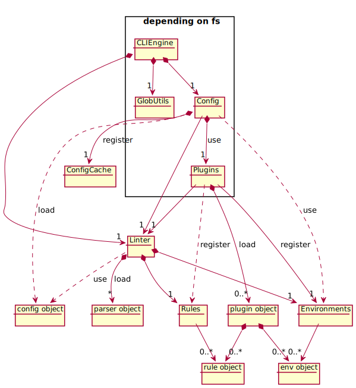
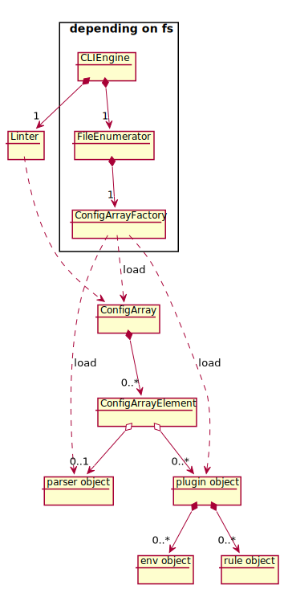

- Start Date: 2019-02-25
- RFC PR: https://github.com/eslint/rfcs/pull/13
- Authors: Toru Nagashima (@mysticatea)

# Config File Improvements

## Summary

This proposal improves our configuration files. This changes the architecture of configuration files to maintain our codebase easier and make enhancing easier.

This RFC fixes two bugs I found while I make a PoC. I guess we don't want to make surprised behaviors on purpose.

- ([link](#fix-error-in-unused-deps)) Even if unused dependencies have some errors, ESLint doesn't throw it. (fixes <a href="https://github.com/eslint/eslint/issues/11396">eslint/eslint#11396</a>)
- ([link](#fix-overrides-order)) The configuration of <code>overrides</code> in shareable configs no longer overwrites user settings in <code>.eslintrc</code> files. (see <a href="#️-fix-a-surprised-behavior-of-overrides">details</a>)

This RFC includes three enhancements. Those would solve the important pains of the ecosystem.

- ([link](#ext-functionality)) ESLint checks the files which are matched by a `overrides[].files` automatically even if the file is not `*.js` (fixes [eslint/eslint#11223]).
- ([link](#overrides-extends)) The configuration of <code>overrides</code> gets supporting <code>extends</code> proeprty and <code>overrides</code> property. (fixes <a href="https://github.com/eslint/eslint/issues/8813">eslint/eslint#8813</a>)
- ([link](#plugin-resolution-change)) ESLint now resolves plugins relative to the config file, but it can throw the plugin conflict error for the version conflict of plugins. (fixes <a href="https://github.com/eslint/eslint/issues/3458">eslint/eslint#3458</a>)

## Motivation

- The codebase about configuration files is complicated. It has made us hard to maintain and enhance the configuration system.
- The current process determines target files at first. Next, it finds configuration files on the directory where each target file exists and that ancestors. This "files-then-config" order prevents adding some enhancements such as `--ext` functionality to our configuration file system.
- Several good ideas have been born in [#9]. We can simplify the logic about configuration files by the ideas.

Therefore, the goal of this RFC is to simplify our codebase by some architecture changes in order to maintain our codebase easier and make enhancing easier.

Then some enhancements that the simplification gives would solve the important pains of the ecosystem.

## Detailed Design

Proof of Concept (implementation): https://github.com/eslint/eslint/tree/proof-of-concept/config-array-in-eslintrc

1. It simplifies the internal structure of configuration files by an array.
1. The config object owns loaded plugins and parsers rather than registers those to somewhere.
1. It changes the plugin loading strategy.
1. It changes the processing order to "config-then-files" from "files-then-config".
1. It restructures the files about CLIEngine and lookup.

### 1. It simplifies the internal structure of configuration files by an array.

When it reads configuration files, it flattens the `extends` property and `overrides` property of the configuration. This is the following order:

1. The loaded configurations of `extends` property.
1. The configuration except `extends` property and `overrides` property.
1. The configurations of `overrides` property.

> [lib/lookup/config-array-factory.js#L635-L680](https://github.com/eslint/eslint/blob/153640180a8944af3a1c488462ed30d0c215f5ed/lib/_lookup/config-array-factory.js#L635-L680) in PoC.

If it cannot load a configuration of `extends` property, it throws an error immediately.

If a loaded configuration of `extends` property has `extends` property or `overrides` property, it flattens those recursively.

<table><td>
<a id="fix-overrides-order">ℹ️</a> <b>User-facing change</b>:<br>
The configuration of <code>overrides</code> in shareable configs no longer overwrites user settings in <code>.eslintrc</code> files. (see <a href="#️-fix-a-surprised-behavior-of-overrides">details</a>)
</td></table>

If a configuration of `overrides` property has `extends` property or `overrides` property, it flattens those recursively. The `files` property and `excludedFiles` property of the configuration are applied to every flattened item. If a flattened item has own `files` property and `excludedFiles` property, it composes those by logical AND.

> [lib/lookup/config-array-factory.js#L601-L624](https://github.com/eslint/eslint/blob/153640180a8944af3a1c488462ed30d0c215f5ed/lib/_lookup/config-array-factory.js#L601-L624) in PoC.

<table><td>
<a id="overrides-extends">ℹ️</a> <b>User-facing change</b>:<br>
The configuration of <code>overrides</code> gets supporting <code>extends</code> proeprty and <code>overrides</code> property. (fixes <a href="https://github.com/eslint/eslint/issues/8813">eslint/eslint#8813</a>)
</td></table>

For duplicated settings, a later element in the array has precedence over an earlier element in the array.

<table><td>
💡 <b>Example</b>:
<pre lang="jsonc">
{
    "extends": ["eslint:recommended", "plugin:node/recommended"],
    "rules": { ... },
    "overrides": [
        {
            "files": ["*.ts"],
            "extends": ["plugin:@typescript-eslint/recommended"],
            "rules": { ... },
        }
    ]
}
</pre>
is flattend to:
<pre lang="jsonc">
[
    // extends
    {
        "name": ".eslintrc.json » eslint:recommended",
        "filePath": "node_modules/eslint/conf/eslint-recommended.js",
        "rules": { ... }
    },
    {
        "name": ".eslintrc.json » plugin:node/recommended",
        "filePath": "node_modules/eslint-plugin-node/lib/index.js",
        "env": { ... },
        "parserOptions": { ... },
        "plugins": { ... },
        "rules": { ... }
    },
    // main
    {
        "name": ".eslintrc.json",
        "filePath": ".eslintrc.json",
        "rules": { ... }
    },
    // overrides (because it flattens recursively, extends in overrides is here)
    {
        "name": ".eslintrc.json#overrides[0] » plugin:@typescript-eslint/recommended",
        "filePath": "node_modules/@typescript-eslint/eslint-plugin/dist/index.js",
        // `matchFile` is merged from the parent `overrides` entry and itself.
        "matchFile": { "includes": ["*.ts"], "excludes": null },
        "parser": { ... },
        "parserOptions": { ... },
        "plugins": { ... },
        "rules": { ... }
    },
    {
        "name": ".eslintrc.json#overrides[0]",
        "filePath": ".eslintrc.json",
        "matchFile": { "includes": ["*.ts"], "excludes": null },
        "rules": { ... }
    }
]
</pre>
</td></table>

### 2. The config object owns loaded plugins and parsers rather than registers those to somewhere.

The loading logic of configuration files is complicated because it has complicated relationships between the config, plugins, parsers, and environments.



The main reason is registration. The loading logic has side-effects that register loaded plugins to the plugin manager, and plugins have side-effects that register rules and environments to other managers.

The codebase can get simple by the removal of the registration. Instead, the internal structure of configuration owns loaded plugins and parsers.



Surprisingly, now the return value of `ConfigArrayFactory.loadFile(filePath)` has all needed information to check files. Previously, we also needed information that was registered somewhere.

<table><td>
💡 <b>Example</b>:
<pre lang="jsonc">
{
    "name": ".eslintrc.json#overrides[0] » plugin:@typescript-eslint/recommended",
    "filePath": "node_modules/@typescript-eslint/eslint-plugin/dist/index.js",
    "parser": {
        "definition": { ... }, // the parser implementation.
        "id": "@typescript-eslint/parser",
        "filePath": "node_modules/@typescript-eslint/parser/dist/index.js",
        "importerPath": "node_modules/@typescript-eslint/eslint-plugin/dist/index.js"
    },
    "parserOptions": {
        "sourceType": "module"
    },
    "plugins": {
        "@typescript-eslint": {
            "definition": { ... }, // the plugin implementation.
            "id": "@typescript-eslint",
            "filePath": "node_modules/@typescript-eslint/eslint-plugin/dist/index.js",
            "importerPath": "node_modules/@typescript-eslint/eslint-plugin/dist/index.js"
        }
    },
}
</pre>
</td></table>

If arbitrary errors happen while loading a plugin or a parser, the config array stores the error information rather than throws it. Because the plugin or the parser might not be used finally.
When `ConfigArray#extractConfig(filePath)` method extracted configuration for a file, if the final configuration contains the error, it throws the error. Here, "extract" means merge the elements in the config array as filtering it by `files` property and `excludedFiles` property.

<table><td>
<a id="fix-error-in-unused-deps">ℹ️</a> <b>User-facing change</b>:<br>
Even if unused dependencies have some errors, ESLint doesn't throw it. (fixes <a href="https://github.com/eslint/eslint/issues/11396">eslint/eslint#11396</a>)
</td></table>

<table><td>
💡 <b>Example</b>:
<pre lang="jsonc">
{
    "name": ".eslintrc.json#overrides[0] » plugin:@typescript-eslint/recommended",
    "filePath": "node_modules/@typescript-eslint/eslint-plugin/dist/index.js",
    "parser": {
        "error": Error, // an error object (maybe "Module Not Found").
        "id": "@typescript-eslint/parser",
        "importerPath": "node_modules/@typescript-eslint/eslint-plugin/dist/index.js"
    },
    "parserOptions": {
        "sourceType": "module"
    },
    "plugins": {
        "@typescript-eslint": {
            "definition": { ... },
            "id": "@typescript-eslint",
            "filePath": "node_modules/@typescript-eslint/eslint-plugin/dist/index.js",
            "importerPath": "node_modules/@typescript-eslint/eslint-plugin/dist/index.js"
        }
    },
}
</pre>
</td></table>

<a id="linter-change"></a>If `Linter#verify` received a `ConfigArray` object, it requires `options.filename` as well. The `Linter` object calls `ConfigArray#extractConfig(filePath)` method and set needed parser, rules, and environments up. If the `options.filename` was `/path/to/<INPUT>.js`, it gives each rule only `<INPUT>` part.

<table><td>
📝 <b>Note</b>:<br>
<p>Now we can implement <a href="https://github.com/eslint/rfcs/pull/3">#3</a> in <code>Linter#verify</code> method because the <code>ConfigArray</code> object has the complete information to handle virtual files. So we get two pros.
<ul>
<li>We don't need to access to the file system for each virtual file.
<li>We don't need to clone the logic of <code>Linter#verifyAndFix</code> method.
</ul>
</td></table>

### 3. It changes the plugin loading strategy.

Currently, ESLint loads three stuff from config files.

1. other config files (`extends` property)
1. parsers (`parser` property)
1. plugins (`plugins` property)

In those, only plugins are special. ESLint resolves plugins relative to the location ESLint was installed, but ESLint resolves other stuff relative to the config file.

This RFC changes this strategy to that ESLint resolves all of the three consistently relative to the config file.

This change introduces a new problem that a plugin can be loaded from two different locations for some situations. Therefore, when `ConfigArray#extractConfig(filePath)` method determines the final config, if a plugin had been loaded from different locations, it throws "plugin conflict" error.

> [lib/lookup/config-array.js#L76-L88](https://github.com/eslint/eslint/blob/153640180a8944af3a1c488462ed30d0c215f5ed/lib/_lookup/config-array.js#L76-L88) in PoC.

<table><td>
<a id="plugin-resolution-change">ℹ️</a> <b>User-facing change</b>:<br>
ESLint now resolves plugins relative to the config file, but it can throw the plugin conflict error for the version conflict of plugins. (fixes <a href="https://github.com/eslint/eslint/issues/3458">eslint/eslint#3458</a>)<br>
</td></table>

<table><td>
<a id="q-robustness-guarantee">❓</a> <b>Open question</b>:<br>
Should we keep <a href="https://gist.github.com/not-an-aardvark/169bede8072c31a500e018ed7d6a8915">Robustness Guarantee</a> for the plugin conflict error? (<a href="#robustness-guarantee">details</a>)<br>
</td></table>

### 4. It changes the processing order to "config-then-files" from "files-then-config".

Currently, first it finds target files by globs, next it finds configs for each target file. Therefore, we could not change target files by configuration files because of this ordering.

This proposal changes that ordering.

1. When the file enumerator entered into a directory,
    1. It finds `.eslintrc.*` file on the directory.
        - If found, it concatenates the found configuration to the parent configuration (just `Array#concat`).
    1. It enumerates files on the directory.
        - If a file is a regular file and matched the current criteria, yields the pair of the file and the current configuration.
        - If a file is a directory, enters into the directory (go step 1).

> [lib/lookup/file-enumerator.js#L303-L360](https://github.com/eslint/eslint/blob/153640180a8944af3a1c488462ed30d0c215f5ed/lib/_lookup/file-enumerator.js#L303-L360) in PoC.

<table><td>
📝 <b>Note</b>:<br>
As a side effect, the file enumerator reuses configuration instances naturally without a special cache logic.
</td></table>

As the result, we can change target files by settings of configuration files.

In this proposal, if any of `overrides` matches a file, the file enumerator yields the file additionally. For example, if `overrides[].files` includes `"*.ts"`, the file enumerator yields `*.ts` files additionally.

> [lib/lookup/file-enumerator.js#L338](https://github.com/eslint/eslint/blob/153640180a8944af3a1c488462ed30d0c215f5ed/lib/_lookup/file-enumerator.js#L338) in PoC.

<table><td>
<a id="ext-functionality">ℹ️</a> <b>User-facing change</b>:<br>
ESLint checks the files which are matched by a <code>overrides[].files</code> automatically even if the file is not <code>*.js</code>. (fixes <a href="https://github.com/eslint/eslint/issues/11223">eslint/eslint#11223</a>)<br>
</td></table>

### 5. It restructures the files about CLIEngine and lookup.

It's premature optimization if we moved a logic only one functionality is using to the shared utility directory. The shared utility directory is similar to global variables, so it makes hard to know who use the utilities.

This proposal moves some utility files to the directory of lookup functionality.

We should be able to understand the lookup logic only the files in [lib/lookup](https://github.com/eslint/eslint/tree/proof-of-concept/config-array-in-eslintrc/lib/_lookup).

## Documentation

This RFC has some breaking changes, so it needs migration guide.

- If people was affected by the plugin resolution change, they have to solve the plugin conflict manually.
- If people was affected by the `overrides` order change, they have to modify their config file.

This RFC has some enhancements, so it needs to update documents.

In https://eslint.org/docs/user-guide/configuring:

- In "Configuring Plugins" section, it adds that plugins which have file extension processors add the file types to lint automatically.
- In "Configuring Plugins" section, it changes the note "Due to the behavior of Node’s require function, a globally-installed instance of ESLint can only use globally-installed ESLint plugins, and locally-installed version can only use locally-installed plugins. Mixing local and global plugins is not supported."
- In "Configuration Based on Glob Patterns" section, it adds that `files` property (except patterns end with `*`) adds the matched files to lint automatically.
- In "Configuration Based on Glob Patterns" section, it removes `extends` and `overrides` from the sentence "Override blocks can contain any configuration options that are valid in a regular config, with the exception of `extends`, `overrides`, and `root`."

In https://eslint.org/docs/developer-guide/working-with-plugins:

- In "Processors in Plugins" section, it adds that file extension processors add the file types to lint automatically.

## Drawbacks

This is a large change. Currently we have multiple pull requests around configuration files, this will conflict with those pull requests severely. And this will be a large change for tests. Our tests really depend on internal structures seriously.

## Backwards Compatibility Analysis

Most cases work fine as is.
But I guess there are some breaking changes.

### ✅ CLIEngine#addPlugin

It can work fine as is.
`CLIEngine` has a `Map<string, Plugin>` for the added plugin, and it gives `FileEnumerator` (then `ConfigArrayFactory.load*` methods) the map, and the loading logic uses the map to load plugins.

### ✅ Linter

It can work fine as is.

Only if a given `config` has `extractConfig` method, `Linter` does the setup process for the config. Otherwise, it works the same as currently.

See [this paragraph](#linter-change) also.

### ✅ LintResultCache

It can work fine as is.

The `ConfigArray` has all information to distinguish if the config was changed since the last time.

### ✅ Plugin resolution change

Because this is after [#7], the effect of the plugin resolution change is limited.

If people are using multiple shareable configs which depend on plugins via `dependencies` field of `package.json`, a package manager may fail to dedupe the plugins. However, most shareable configs are using `peerDependencies` to depend on plugins currently.

### ⚠️ Fix a surprised behavior of `overrides`.

Currently, `overrides` is applied after all `overrides` properties are merged. This means that the `overrides` in a shareable config priors to the setting in your `.eslintrc`.

```yml
extends:
    - foo
rules:
    eqeqeq: error # silently ignored if the "foo" has the "eqeqeq" setting in "overrides".
```

After this proposal, the setting in your `.eslintrc` priors to the setting in shareable configs always.
This is a breaking change, but I think this is a bug fix.

### ⚠️ Lint files other than `*.js` automatically.

If a configuration has `overrides` property with specific file types or depends on plugins which have file extension processors, ESLint now verifies those files additionally.

I guess people are using `--ext` option together in most cases, but it can affect unintentional.

## Alternatives

- [#9] is the alternative. But double duplicate features cause confusion for the ecosystem. For newcomers, a mix of articles about two config systems makes hard to understand ESLint. For non-English users, the official document is far.
- [#5] and [#14] are alternatives about the plugin resolution change. But those need some complex logic.

## Open Questions

- <a href="#q-robustness-guarantee" id="robustness-guarantee">❓</a> Should we keep [Robustness Guarantee] for the plugin conflict error?<br>
  As @not-an-aardvark's gist described, if a shareable config pinned a plugin version in a patch version, it may disable dedupe of a plugin manager, then it may cause breaking user's builds.<br>
  Should we address this problem?

## Frequently Asked Questions

-

## Related Discussions

- [#14]
- [#9]
- [#7]
- [#5]
- [#3]
- [eslint/eslint#3458]
- [eslint/eslint#6732]
- [eslint/eslint#8813]
- [eslint/eslint#9505]
- [eslint/eslint#9897]
- [eslint/eslint#10125]
- [eslint/eslint#10643]
- [eslint/eslint#10891]
- [eslint/eslint#11223]
- [eslint/eslint#11396]

Especially, this proposal is inspired by the discussion on [#9].

[#14]: https://github.com/eslint/rfcs/pull/14
[#9]: https://github.com/eslint/rfcs/pull/9
[#7]: https://github.com/eslint/rfcs/pull/7
[#5]: https://github.com/eslint/rfcs/pull/5
[#3]: https://github.com/eslint/rfcs/pull/3
[eslint/eslint#3458]: https://github.com/eslint/eslint/issues/3458
[eslint/eslint#6732]: https://github.com/eslint/eslint/issues/6732
[eslint/eslint#8813]: https://github.com/eslint/eslint/issues/8813
[eslint/eslint#9505]: https://github.com/eslint/eslint/issues/9505
[eslint/eslint#9897]: https://github.com/eslint/eslint/issues/9897
[eslint/eslint#10125]: https://github.com/eslint/eslint/issues/10125
[eslint/eslint#10643]: https://github.com/eslint/eslint/issues/10643
[eslint/eslint#10891]: https://github.com/eslint/eslint/issues/10891
[eslint/eslint#11223]: https://github.com/eslint/eslint/issues/11223
[eslint/eslint#11396]: https://github.com/eslint/eslint/issues/11396
[Robustness Guarantee]: https://gist.github.com/not-an-aardvark/169bede8072c31a500e018ed7d6a8915
