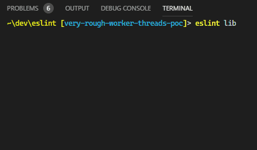

- Start Date: 2019-10-20
- RFC PR: (leave this empty, to be filled in later)
- Authors: Toru Nagashima ([@mysticatea](https://github.com/mysticatea))

# Formatter v2

## Summary

This RFC adds the custom formatter v2 that supports streaming based on [RFC40].

## Motivation

When ESLint verifies many files, it spent time silently. People may be worried about "Is ESLint hanging up?", "When does it finish?", etc. Streaming support will resolve that.

## Detailed Design

This RFC has two parts.

- Adding new formatter style.
- Updating `ESLint#getFormatter()` method.

### ● New Formatter Style

This RFC adds a new formatter style.

```js
module.exports = {
  formatterVersion: 2,

  async *format(resultIterator, context) {
    //...
  },
}
```

#### `formatterVersion`

This is the constant `2`.

We may add other numbers such as `3` in the future if we want to change the arguments of the `format()` function. Between the current and `2`, the first argument was changed from `Array<LintResult>` to `AsyncIterable<LintResult>`. ESLint distinguishes by this property whether the formatter supports the new argument.

#### `format(resultIterator, context)`

Tha main function of the formatter. This function transforms the lint results to strings asynchronously.

##### Parameters

| Name             | Type                        | Description                     |
| :--------------- | :-------------------------- | :------------------------------ |
| `resultIterator` | `AsyncIterable<LintResult>` | The stream of the lint results. |
| `context`        | `Object`                    | The formatting context.         |

The `context` parameter has the following properties:

- `context.eslintVersion` ... The version of ESLint. E.g. `"7.0.0"`. If a formatter prints the version, it may be useful for debug.
- `context.formatterVersion` ... The actual version of the formatter spec of this call. This is always `2` for now. In the future, if we added v3 formatter, this property will help custom formatter authors to support both v2 and v3.
- `context.isTTY` ... If `true` then ESLint outputs the formatted texts to TTY. This means we can use [CSI sequences] to represent stuff such as progress bars. Otherwise, if `--output` option is present or the eslint command is redirected to another program, this is `false`.
- `context.getRuleMeta(ruleId)` ... The function to get the metadata of a rule. This corresponds to `metadata.rulesMeta` property of the current formatter. This RFC changes the `metadata.rulesMeta` property to a function because we cannot know all plugin rules that the linting will use at this time, because of asynchronous. On the other hand, we can get the rules of the yielded results.

##### Return Value

The return value is an async iterable object that iterates strings.

The formatter author can include [CSI sequences] to represent stuff such as progress bars if `context.isTTY` is `true`.

##### Examples

##### The `stylish` formatter with progress

See [/lib/cli-engine/formatters/stylish.js].



###### Print results in one by one

```js
module.exports = {
  formatterVersion: 2,
  async *format(resultIterator) {
    for await (const { filePath, messages } of resultIterator) {
      for (const { column, line, message } of messages) {
        yield `${filePath}:${line}:${column} - ${message}\n`
      }
    }
  },
}
```

###### Print results in a stable order, along with progress state

```js
const { ESLint } = require("eslint")
const ClearLine = "\x1b[1K\x1b[1G"

module.exports = {
  formatterVersion: 2,
  async *format(resultIterator, { isTTY }) {
    const results = []
    let fileCount = 0
    let errorCount = 0

    // Show progress
    for await (const result of resultIterator) {
      results.push(result)
      fileCount += 1
      errorCount += result.errorCount

      if (isTTY) {
        yield [
          results.length === 0 ? "" : ClearLine,
          fileCount,
          "file(s) linted and",
          errorCount,
          "error(s) found.",
        ].join(" ")
      }
    }
    if (isTTY && results.length >= 1) {
      yield ClearLine
    }

    // Sort results
    results.sort(ESLint.compareResultsByFilePath)

    // Show results
    for (const { filePath, messages } of results) {
      for (const { column, line, message } of messages) {
        yield `${filePath}:${line}:${column} - ${message}\n`
      }
    }
  },
}
```

#### Support both v1 and v2

[/lib/cli-engine/formatters/stylish.js] supports both v1 formatter and v2 formatter. The essence is:

```js
function stylish(results) {
  // ... (format results) ...
  return formattedText
}

stylish.formatterVersion = 2
stylish.format = async function*(resultIterator) {
  const results = []
  // ... (show progress while collecting results) ...
  yield stylish(results)
}

module.exports = stylish
```

In this case, old ESLint just calls the `stylish` function and new ESLint will call the `stylish.format` function.

### ● `ESLint#getFormatter()`

The `ESLint` class is introduced in [RFC40].

This RFC adds the second parameter to pass `isTTY` into the formatter's adapter. For example:

```js
const { ESLint } = require("eslint")

const eslint = new ESLint()
const stylish = eslint.getFormatter("stylish")
const resultIterator = eslint.executeOnFiles(patterns)
const options = { isTTY: process.stdout.isTTY }

//                                               ↓ Here!
for await (const text of stylish(resultIterator, options)) {
  process.stdout.write(text)
}
process.stdout.write("\n")
```

If the `options` is not present, defaults to `{ isTTY: false }`.

#### Internal Adapters

If the loaded formatter has `formatterVersion` property with an integer, the adapter gives the `format` method of the formatter the lint result iterator. Otherwise, the adapter collects the results, sort the results, then gives the formatter the collected results (for compatible with v1).

See also a PoC [/lib/eslint/eslint.js#L393-L421](https://github.com/eslint/eslint/blob/e0f5548b0ccd9ef0c86c1c692c60642e33561b57/lib/eslint/eslint.js#L393-L421).

If the `formatterVersion` was less than `2`, the `ESLint#getFormatter()` method throws an error "unknown version."
If the `formatterVersion` was greater than `2`, the `ESLint#getFormatter()` method considers the formatter as supporting v2 as well because the formatter knows the existence of v2. This behavior will help the formatter authors to support all of the formatter versions in their custom formatters in the future.

## Documentation

We should update:

- the "[Working with Custom Formatters](https://eslint.org/docs/developer-guide/working-with-custom-formatters)" page.
- the "[Node.js API](https://eslint.org/docs/developer-guide/nodejs-api)" page for the new parameter of the adapter that `ESLint#getFormatter()` method returns.

## Drawbacks

It increases maintenance costs.

## Backwards Compatibility Analysis

Once [RFC40] is implemented, this RFC doesn't have any breaking changes.

## Alternatives

- Using [Streams]. Because the eventual destination is a writable stream, it's reasonable if the formatter is a transform stream that is from lint results to strings. However, the stream formatter forces the `ESLint#executeOnFiles()` to return a readable stream of lint results instead of an async iterable for consistency, and streams don't have the interoperability with the async iteration language feature enough at this time (Node v10). Async iteration is greater than streams for some points: the error propagation and syntax supports (`for-await-of` loops and async generators).

## Related Discussions

- https://github.com/eslint/eslint/issues/1098 - Show results for each file as eslint is running
- https://github.com/eslint/rfcs/pull/40 - New: `ESLint` Class Replacing `CLIEngine`

[rfc40]: https://github.com/eslint/rfcs/pull/40
[csi sequences]: https://en.wikipedia.org/wiki/ANSI_escape_code#CSI_sequences
[/lib/cli-engine/formatters/stylish.js]: https://github.com/eslint/eslint/blob/995c5dfb92892bbf47c5325c12038c51c5d0fadf/lib/cli-engine/formatters/stylish.js
[streams]: https://nodejs.org/api/stream.html
