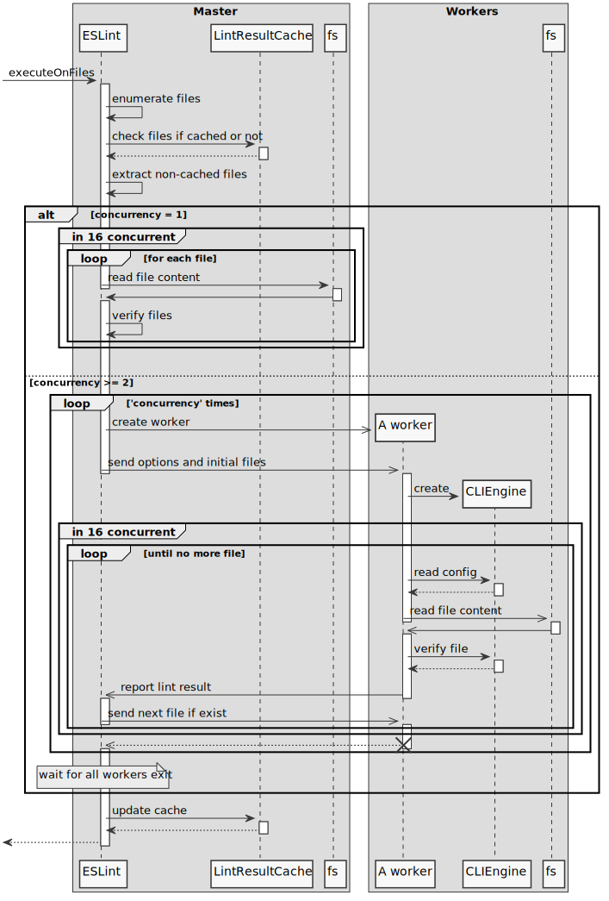

- Start Date: 2019-09-29
- RFC PR: https://github.com/eslint/rfcs/pull/42
- Authors: Toru Nagashima ([@mysticatea](https://github.com/mysticatea))

# Lint files in parallel if many files exist

## Summary

This RFC adds the supports for parallel linting by `worker_threads`/`child_process` modules.

## Motivation

Linting logic uses CPU heavily, so parallel linting by threads may reduce spent time.

## Detailed Design

**PoC**: [eslint/eslint#very-rough-worker-threads-poc](https://github.com/eslint/eslint/tree/very-rough-worker-threads-poc/lib/eslint)

This RFC has two steps.

**The step 1 (semver-minor):**

- Adds `--concurrency` CLI option to specify the number of worker threads. Defaults to `1`.
- Adds `concurrency` constructor option to `ESLint` class to specify the number of worker threads. Defaults to `1`.
- Changes the behavior of `ESLint#executeOnFiles(patterns)` method.

**The step 2 (semver-major):**

- Changes the default of the `--concurrency` CLI option to `"auto"`.
- Changes the default of the `concurrency` constructor option to `"auto"`.

### [STEP 1] New `--concurrency` CLI Option

The `--concurrency` has an argument. The argument should be a positive integer or `"auto"`. Defaults to `1`.

- If `1` is present, ESLint does linting in the main thread.
- If another integer is present, ESLint creates this number of worker threads then the worker threads do linting.

If `auto` is present, ESLint estimates the best value from the number of target files. It's the number of target files divided by the constant `128`, but `os.cpus().length` at most.

```js
concurrency = Math.min(os.cpus().length, Math.ceil(targetFiles.length / 128))
```

This means that ESLint does linting in the main thread if the number of target files is less than `128` in order to avoid the overhead of multithreading. But ESLint does linting with using worker threads automatically if target files are many.

If `--concurrency` option is present along with the following options, ESLint throws a fatal error.

- `--stdin`
- `--stdin-filename`
- `--init`
- `-h`, `--help`
- `-v`, `--version`
- `--print-config`
- `--env-info`

### [STEP 1] New `concurrency` constructor option of `ESLint` class

`ESLint` class is the new API that is discussed in [RFC 40](https://github.com/eslint/rfcs/pull/40).

The `concurrency` option corresponds to `--concurrency` CLI option. Defaults to `1`. If `"auto"` is present, `ESLint` class estimates the best value with the way the previous section descrived.

This RFC doesn't change `CLIEngine` class because this requires asynchronous API to expose.

### [STEP 1] New behavior of `ESLint#executeOnFiles(patterns)` method

The overview is:



1. Master enumerates the lint target files.
1. Master checks if the files exist in the lint result cache and it extracts only the files which are not cached.
1. Master estimates the proper `concurrency` from the number of the extracted files if `"auto"` is present.
1. Lint the extracted files:
   - If `concurrency` is `1`, master [verifies files][verify files] directly. It doesn't create any worker.
   - Otherwise, master creates workers then the workers [verify files]. The number of the workers is `concurrency`.
     1. Master sends the initial data to each worker. The initial data contains the constructor options of `CLIEngine` and several files.
     1. Workers [verify files]. It reports the lint result to master, and master may send the next file to the worker. The worker verifies the received file.
     1. Workers exit with `0` after it reported the result of all files.
1. Master collects the lint result from workers then write it to the lint result cache.
1. Master returns the merged result from cache and workers.

#### Worker's implementation

Worker can be `require("worker_threads").Worker` or `require("child_process").ChildProcess`.

If `v12.11.0` or newer version of Node.js runs ESLint, it's `require("worker_threads").Worker`. Otherwise it's `require("child_process").ChildProcess`.

#### About `--cache` option

We can use parallel linting along with `--cache` option because worker threads don't touch the cache. Master gives worker threads only files which are not cached (or cache was obsolete) and updates the cache with the collected result.

#### About `--fix` option

We can use parallel linting along with `--fix` option. ESLint modifies files after all linting completed.

#### About `--debug` option

We can use parallel linting along with `--debug` option, but ESLint cannot guarantee the order of the debug log. The order of the logs that are received from worker threads is messed.

#### About Error Handling

If exceptions happen in worker threads, the worker transfers the error information to the main thread if possible. The transferred information contains the properties of `message`, `stack`, `messageTemplate`, and `messageData`.

Therefore, people can see the error message as-is even if it happened in worker threads.
For example:

```
$ eslint lib
Error: FAILED!!!
Occurred while linting C:\Users\t-nagashima.AD\dev\eslint\lib\rules\no-mixed-operators.js:229
    at BinaryExpression (C:\Users\t-nagashima.AD\dev\eslint\lib\rules\eqeqeq.js:152:27)
    at C:\Users\t-nagashima.AD\dev\eslint\lib\linter\safe-emitter.js:45:58
    at Array.forEach (<anonymous>)
    at Object.emit (C:\Users\t-nagashima.AD\dev\eslint\lib\linter\safe-emitter.js:45:38)
    at NodeEventGenerator.applySelector (C:\Users\t-nagashima.AD\dev\eslint\lib\linter\node-event-generator.js:253:26)
    at NodeEventGenerator.applySelectors (C:\Users\t-nagashima.AD\dev\eslint\lib\linter\node-event-generator.js:282:22)
    at NodeEventGenerator.enterNode (C:\Users\t-nagashima.AD\dev\eslint\lib\linter\node-event-generator.js:296:14)
    at CodePathAnalyzer.enterNode (C:\Users\t-nagashima.AD\dev\eslint\lib\linter\code-path-analysis\code-path-analyzer.js:646:23)
    at C:\Users\t-nagashima.AD\dev\eslint\lib\linter\linter.js:936:32
    at Array.forEach (<anonymous>)
```

As a side note, master terminates the other workers if a worker reported an error.

#### Locally Concurrency

Now ESLint does linting in parallel by thread workers if target files are many.

Apart from that, each worker does linting concurrently by non-blocking IO to use CPU resource efficiently. This is a simple read-lint-report loop with `Promise.all()`:

```js
// Wait for all loops finish.
await Promise.all(
  // Run the loop concurrently.
  initialFiles.map(async initialFilePath => {
    let filePath = initialFilePath

    do {
      // Read file content by non-blocking IO.
      const text = await readFile(filePath, "utf8")
      // Lint the file.
      const result = verifyText(engine, filePath, text)
      // Send the lint result and get the next file path. This is also non-blocking async op.
      filePath = await pushResultAndGetNextFile(result)
    } while (filePath)
  }),
)
```

This logic is used in two places:

1. Each worker use it.
1. Master uses it in the main thread if target files are not many.

Therefore, if `concurrency` is `1` then:

```
Main thread
├ 🔁 Read-lint-report loop
├ 🔁 Read-lint-report loop
├ ...
└ 🔁 Read-lint-report loop
```

And if `concurrency` is greater than `1` then:

```
Main thread
├ ⏩ Worker thread
│    ├ 🔁 Read-lint-report loop
│    ├ ...
│    └ 🔁 Read-lint-report loop
├ ⏩ Worker thread
│    ├ 🔁 Read-lint-report loop
│    ├ ...
│    └ 🔁 Read-lint-report loop
├ ...
└ ⏩ Worker thread
      ├ 🔁 Read-lint-report loop
      ├ ...
      └ 🔁 Read-lint-report loop
```

#### Loading Config

On the other hand, this RFC doesn't change the logic that loads config files. It's still synchronous. Because the logic is large and the configs are cached in most cases.

We can improve config loading by async in the future, but it's out of the scope of this RFC.

#### Constants

This RFC contains two constants.

- `128` ... the denominator to estimate the proper `concurrency` option value.
- `16` ... concurrency for non-blocking IO.

Those values are changeable by measuring performance in real.

#### Performance

Please try the PoC.

```
npm install github:eslint/eslint#very-rough-worker-threads-poc
```

This section is an instance of performance measurement. The worker threads make ESLint over 2x faster if there are many files.

- Processor: Intel Core i7-8700 CPU (12 processors)
- RAM: 16.0 GB
- OS: Windows 10 Pro 64bit
- Node.js: 12.11.0

```
$ eslint lib tests/lib --concurrency 1
Number of files: 697
Lint files in the main thread.
Linting complete in: 19636ms

$ eslint lib tests/lib --concurrency auto
Number of files: 697
Lint files in 6 worker threads.
Linting complete in: 7486ms

$ eslint lib --concurrency 1
Number of files: 368
Lint files in the main thread.
Linting complete in: 8442ms

$ eslint lib --concurrency auto
Number of files: 368
Lint files in 3 worker threads.
Linting complete in: 4672ms
```

If forced to use workers with a few files, it's slower.

```
$ eslint lib/cli-engine --concurrency auto
Number of files: 28
Lint files in the main thread.
Linting complete in: 1521ms

$ eslint lib/cli-engine --concurrency 2
Number of files: 28
Lint files in 2 worker threads.
Linting complete in: 2054ms
```

### [STEP 2] Changing the default of `concurrency` option to `"auto"`

This change needs a major release.

ESLint gets using worker threads by default if target files are many.

## Documentation

- The "[Command Line Interface](https://eslint.org/docs/user-guide/command-line-interface)" page should describe new `--concurrency` option.
- The "[Node.js API](https://eslint.org/docs/developer-guide/nodejs-api)" page should describe new `concurrency` option.
- When step 2, it needs an entry of the migration guide because of a breaking change.

## Drawbacks

This feature introduces complexity for parallelism. It will be an additional cost to maintain our codebase.

This feature might not fit `eslint-plugin-import` and `@typescript-eslint`. Those have to parse the entire codebase to check types, but workers cannot share the parsed information. Every worker has to parse the entire codebase individually. But linting in parallel is faster than single-thread in spite of the cost of duplicate works.

## Backwards Compatibility Analysis

Step 1 is not a breaking change. It just adds a new option.

Step 2 is a breaking change technically.

- If a parser/plugin shares state for multiple files and the state can changes the parser/plugin behavior, the workflow is broken. Because every worker thread cannot share state each other.
- If a parser/plugin consumes OS resources exclusively (e.g., bind a TCP port), the workflow is broken. Because it runs multiple times at the same time by worker threads.
- If a parser/plugin writes a file which has a constant name (e.g., common cache file), the workflow is broken as a race condition.

However, I think that the above is enough rare cases and the impact is limited.

## Alternatives

- [RFC 4](https://github.com/eslint/rfcs/pull/4) and [RFC 11](https://github.com/eslint/rfcs/pull/11) implement this feature behind a flag. On the other hand, this RFC does lint files in parallel by default if files are many, and people can enforce to not use workers by `--concurrency 1` option.

## Related Discussions

- https://github.com/eslint/eslint/issues/3565 - Lint multiple files in parallel [$500]
- https://github.com/eslint/eslint/issues/10606 - Make CLIEngine and supporting functions async via Promises
- https://github.com/eslint/eslint/pull/12191 - New: Allow parallel linting in child processes
- https://github.com/eslint/rfcs/pull/4 - New: added draft for async/parallel proposal
- https://github.com/eslint/rfcs/pull/11 - New: Lint files in parallel

[verify files]: #locally-concurrency
