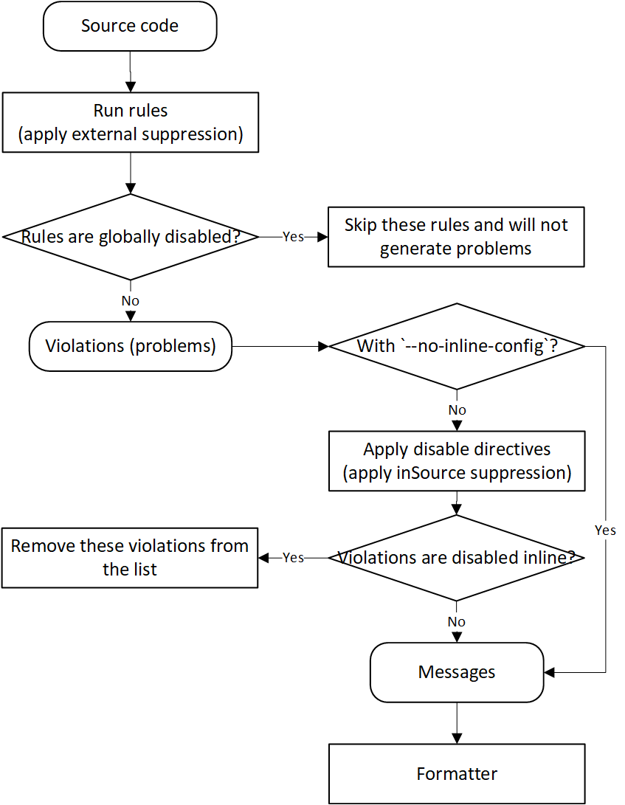

- Repo: eslint/eslint
- Start Date: 2021-07-28
- RFC PR: (leave this empty, to be filled in later)
- Authors: Yiwei Ding

# Add suppression information in the output of ESLint

## Summary

Violations can be suppressed by inline directive comments. We propose to add a `--track-suppressions` CLI option for adding suppression information, including its kind and justification, in the output of ESLint.

The code below shows the example in the format of SARIF and JSON:

```json
SARIF format
{
  ... Some other info ...
  =======================
  "results": [
    {
      "level": "error",
      "message": {
        "text": "'a' is not defined."
      },
      "locations": [
        {
          "physicalLocation": {
            "artifactLocation": {
              "uri": "file:///C:/Users/yiweiding/Documents/projects/test/1.js",
              "index": 0
            },
            "region": {
              "startLine": 1,
              "startColumn": 1
            }
          }
        }
      ],
      "suppressions": [
        {
          "kind": "inSource",
          "justification": "Sample justification message."
        }
      ],
      "ruleId": "no-undef",
      "ruleIndex": 0
    }
  ]
}
```

```json
JSON format
[
  {
    "filePath":"C:\\Users\\yiweiding\\Documents\\projects\\test\\1.js",
    "messages":[
      {
        "ruleId":"no-undef",
        "severity":2,
        "message":"'a' is not defined.",
        "line":1,
        "column":1,
        "nodeType":"Identifier",
        "suppressions":[
          {
            "kind":"directive",
            "justification":"Sample justification message."
          }
        ],
        "messageId":"undef",
        "endLine":1,
        "endColumn":2
      }
    ],
    "errorCount":0,
    "warningCount":0,
    "fixableErrorCount":0,
    "fixableWarningCount":0,
    "usedDeprecatedRules":[]
  }
]
```

## Motivation

### Problem

ESLint is a famous tool for identifying and reporting on patterns found in ECMAScript/JavaScript code. When codes violate one or more defined rules, ESLint will report warnings or errors:

```json
"messages": [
  {
    "ruleId":"no-undef",
    "severity":2,
    "message":"'b' is not defined.",
    "line":2,
    "column":1,
    "nodeType":"Identifier",
    "messageId":"undef",
    "endLine":2,
    "endColumn":2
  }
]
```


In our scenarios, when violations are suppressed, Security Development Lifecycle (SDL) tools, such as ESLint, are expected to export suppression information, including its kind and justification. We could take advantage of this info to generate corresponding signals for auditing purposes.

```json
"messages": [
  {
    "ruleId":"no-undef",
    "severity":2,
    "message":"'a' is not defined.",
    "line":2,
    "column":1,
    "nodeType":"Identifier",
    "messageId":"undef",
    "endLine":2,
    "endColumn":2,
    "suppressions": [
      {
        "kind":"directive",
        "justification":"Sample justification message."
      }
    ]
  }
]
```

### Suppression in ESLint

The only way to suppress (or disable in ESLint) warnings/errors (violations) is using directive comments inside of a file, according to [disabling-rules](https://github.com/eslint/eslint/blob/master/docs/user-guide/configuring/rules.md#disabling-rules) and [comments in GitHub](https://github.com/eslint/eslint/issues/14784#issuecomment-878522942):

1. Block comment - Codes between `eslint-disable` and `eslint-enable` are suppressed by defined rules. If rules are not specified, any warnings or errors will be suppressed.
   ```javascript
   /* eslint-disable no-undef -- Justification example */
   a = 1;
   /* eslint-enable no-undef */
   ```
2. Line comment - `eslint-disable-line` can be used to suppress current line of code, and `eslint-disable-next-line` to suppress the next line of code.
    ```javascript
    console.log('foo'); // eslint-disable-line no-console -- Justification example
    ```
    ```javascript
    // eslint-disable-next-line no-console -- Justification example
    console.log('bar');
    ```

Violations can be suppressed inline more than one times:

```javascript
/* eslint-disable no-undef -- Justification example 1 */
a = 1; // eslint-disable-line no-undef -- Justification example 2
/* eslint-enable no-undef */
```

In that case, the first suppression will work while the rest of them will be treated as `unusedDisableDirectives`.

When an error or warning is suppressed, it will not be output. Particularly, an option `--no-inline-config` can disable all inline suppressions, where all errors and warnings not disabled by configuration files will be output.

Currently, ESLint cannot dump these output messages into the SARIF format. A tool [ESLint.Formatter](https://github.com/microsoft/sarif-sdk/blob/main/src/ESLint.Formatter/sarif.js) can be used to convert the output of ESLint to SARIF format:

```
.\node_modules\.bin\eslint.cmd 1.js -f @microsoft/eslint-formatter-sarif -o 1.sarif
```

```json
SARIF format
{
  ... Some other info ...
  =======================
  "results": [
    {
      "level": "error",
      "message": {
        "text": "'a' is not defined."
      },
      "locations": [
        {
          "physicalLocation": {
            "artifactLocation": {
              "uri": "file:///C:/Users/yiweiding/Documents/projects/test/1.js",
              "index": 0
            },
            "region": {
              "startLine": 1,
              "startColumn": 1
            }
          }
        }
      ],
      "ruleId": "no-undef",
      "ruleIndex": 0
    }
  ]
}
```

JSON is a more popular format for the users of ESLint:

```
.\node_modules\.bin\eslint.cmd 1.js -f json -o 1.json
```

```json
JSON format
[
  {
    "filePath":"C:\\Users\\yiweiding\\Documents\\projects\\test\\1.js",
    "messages":[
      {
        "ruleId":"no-undef",
        "severity":2,
        "message":"'a' is not defined.",
        "line":1,
        "column":1,
        "nodeType":"Identifier",
        "messageId":"undef",
        "endLine":1,
        "endColumn":2
      }
    ],
    "errorCount":0,
    "warningCount":0,
    "fixableErrorCount":0,
    "fixableWarningCount":0,
    "usedDeprecatedRules":[]
  }
]
```

Figure Data Flow below is a high-level understanding of the current design.



- When rules are suppressed in-source (`eslint-disable` inside of a file), ESLint will still run the rules but then remove any lint messages that were triggered with the specified rule(s).

### What we need

As mentioned above, what we need is to allow engineers to provide justification in the suppression and output the suppression information.

To minimize changes, we propose to use the `-- Description` part of the suppression as "Justification". More specifically, for directive suppression (or inline directive comments in ESLint), the description after two or more consecutive dashes can be treated as the justification.

For example:

```javascript
/* eslint-disable no-undef -- Justification example */
a = 1;
/* eslint-enable no-undef */
```
```javascript
console.log("foo"); // eslint-disable-line no-console -- Justification example
```
```javascript
// eslint-disable-next-line no-console -- Justification example
console.log("bar");
```

Then we may get:

```json
{"kind": "directive", "justification": "Justification example"}
```

If a violation is inline-suppressed multiple times, all suppression entries will be recorded, according to [suppressions property](https://docs.oasis-open.org/sarif/sarif/v2.0/csprd02/sarif-v2.0-csprd02.html#_Toc10127852). So `unusedDisableDirectives` might always be empty. A suppression list would be preferred to gather all suppression information of a violation:

```json
suppressions: [
  {"kind": "directive", "justification": "Justification message 1"},
  {"kind": "directive", "justification": "Justification message 2"}
]
```

## Detailed Design

### Goal

1. Keep the current behavior of ESLint, i.e., errors/warnings will not be shown on the command line if the related rules are disabled, unless `--no-inline-config` is used.
2. When the new CLI option `--track-suppressions` is used, the violations (problems) that disabled by inline comments will not be removed.
3. Add suppression info in the output of ESLint. For directive suppressions, we generate suppression info where `kind` is `directive` and `justification` is the description in the directive comments (words after two or more consecutive dashes mentioned above).
    
    For example:
        
    ```javascript
    /* eslint-disable no-undef -- Justification example */
    a = 1;
    /* eslint-enable no-undef */
    ```
    ```javascript
    console.log("foo"); // eslint-disable-line no-console -- Justification example
    ```
    ```javascript
    // eslint-disable-next-line no-console -- Justification example
    console.log("bar");
    ```

    Output:

    ```json
    {"kind": "directive", "justification": "Justification example"}
    ```

### General Design

We are proposing to add a new CLI option `--track-suppressions` to output suppressions without prompting disabled errors/warnings.


Input:

```
.\node_modules\.bin\eslint.cmd 1.js --track-suppressions -f @microsoft/eslint-formatter-sarif -o 1.sarif
```

Output:

```json
SARIF format
{
  ... Some other info ...
  =======================
  "results": [
    {
      "level": "error",
      "message": {
        "text": "'a' is not defined."
      },
      "locations": [
        {
          "physicalLocation": {
            "artifactLocation": {
              "uri": "file:///C:/Users/yiweiding/Documents/projects/test/1.js",
              "index": 0
            },
            "region": {
              "startLine": 1,
              "startColumn": 1
            }
          }
        }
      ],
      "suppressions": [
        {
          "kind": "inSource",
          "justification": "Sample justification message."
        }
      ],
      "ruleId": "no-undef",
      "ruleIndex": 0
    }
  ]
}
```

Input:

```
.\node_modules\.bin\eslint.cmd 1.js --track-suppressions -f json -o 1.json
```

Output:

```json
JSON format
[
  {
    "filePath":"C:\\Users\\yiweiding\\Documents\\projects\\test\\1.js",
    "messages":[
      {
        "ruleId":"no-undef",
        "severity":2,
        "message":"'a' is not defined.",
        "line":1,
        "column":1,
        "nodeType":"Identifier",
        "suppressions":[
          {
            "kind":"directive",
            "justification":"Sample justification message."
          }
        ],
        "messageId":"undef",
        "endLine":1,
        "endColumn":2
      }
    ],
    "errorCount":0,
    "warningCount":0,
    "fixableErrorCount":0,
    "fixableWarningCount":0,
    "usedDeprecatedRules":[]
  }
]
```

### Add new CLI option `--track-suppressions`

We propose to add a new CLI option `--track-suppressions` for the new feature. Without the option, ESLint will work as it is currently, and `suppressions` property should not exist in the output. With this option, ESLint is expected to export all violations, including suppressed ones. `suppressions` should be _empty_ for non-suppressed violations, while `suppressions` should be a list for suppressed ones, according to [suppressions property](https://docs.oasis-open.org/sarif/sarif/v2.0/csprd02/sarif-v2.0-csprd02.html#_Toc10127852).

### Parse description in comments as `Justification`

We propose not to ignore the text after two or more dashes in comments and considered it as the justification of a suppression. The modification should be in `getDirectiveComments`.

### Add suppressions attribute in `LintMessage`

`LintMessage` is the type that finally output to the formatter. Currently it contains `ruleId`, `severity`, `message`, etc. What we desire is a `suppressions` attribute in `LintMessage` when the CLI option `--track-suppressions` used. It should be a list that contains a suppression entry (`{kind: "directive", justification: "Fake justification message."}`).

### Reserve directive suppression

In the step of apply directive suppression, ESLint will not remove the problems that should be disabled by directive comments if it gets the `--track-suppressions` option. These problems will be reserved and added `{kind: "directive", justification: "Justification message example."}`.

NOTE that the kind `directive` should be converted to `inSource` for SARIF according to [kind property](https://docs.oasis-open.org/sarif/sarif/v2.1.0/os/sarif-v2.1.0-os.html#_Toc34317735).

### Modify `CLIEngine` and related formatters

As mentioned, we are not going to change the current behavior of ESLint. Without `--no-inline-config`, ESLint should not report errors/warnings in CMD whether with `--track-suppressions` option or not. In `CLIEngine`, when `suppressions` of a message is not null or empty (which means this message should be suppressed and not be reported), this message would be skipped or ignored. Additionally, the related formatters, such as stylish, should also be modified.

## Documentation

Add examples and explanations of the option `--track-suppressions` to _User guide – Command Line Interface_.

## Drawbacks

- Additional contexts must be transferred across modules, such as `justification` in `directives` and `suppressions` in `LintMessage`.
- Related formatters, such as stylish, should be modified to keep the current behavior.

## Backwards Compatibility Analysis

Basically, current users would not feel any difference, since the proposed feature would only work with the new option. Without the option `--track-suppressions`, any current behaviors would not be changed.

## Alternatives

No.

## Open Questions

Currently no.

## Help Needed

No.

## Frequently Asked Questions

TBD.

## Related Discussions

[eslint/eslint#14784](https://github.com/eslint/eslint/issues/14784) Add suppression information in the output of ESLint
