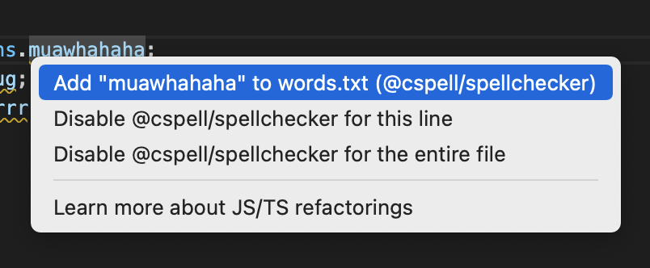

-   Repo: eslint/eslint
-   Start Date: 2022-09-19
-   RFC PR: (leave this empty, to be filled in later)
-   Authors: [Jason Dent](https://github.com/jason3s)

# Notify Plugins on Fix

## Summary

Notify Plugins when a fix has been applied. Currently a plugin has no way to know if a fix has been applied.

## Motivation

The primary motivation for this RFC is to support interactive environments such as an editor where the actual fix might be an external side-effect.

### Context

As the author of the spellchecker plugin: [@cspell/eslint-plugin](https://www.npmjs.com/package/@cspell/eslint-plugin), I would like to present the user a "fix" that allows the user to add a word to their custom dictionary. See: [CSpell ESLint Plugin: Configuration option to add words to the dictionary · Issue #3233](https://github.com/streetsidesoftware/cspell/issues/3233).

When used with an editor extension like VS Code ESLint, something like the following would show up:



If the fix is applied, the spellchecker plugin would add the word to the custom dictionary.

### Problem

In the current ESLint implementation, a `ReportFixer` does not have the ability to provide a custom fix action or to know if a fix has been applied so it can take a custom action.

## Detailed Design

Note: the design below maintains the current flow and assumptions of ESLint. This is not an introduction of a new type of fix.

### Approaches

Two options come to mind:

1. Add an optional `applied` function to `Fix` that is called when a fix has been applied.
   This is the easiest fix:
   https://github.com/eslint/eslint/blob/0bcd2255c40b5c115a95181864776b0dd456c2dc/lib/linter/source-code-fixer.js#L102-L106
   Becomes something like this:
    ```js
    output += text.slice(Math.max(0, lastPos), Math.max(0, start));
    output += fix.text;
    fix?.applied();
    lastPos = end;
    ```
1. `context` provides an event emitter than can be listen to:
    ```js
    context.onFixApplied((fix) => console.log(fix));
    ```
    This provides the ability of any extension to listen for fixes and take an action.

### Approach 1 - Support optional `applied` method on a `Fix`.

This is the simplest approach. If a plugin provides the `applied` function on the `fix`, then it is called where `this` is the `fix`.

### Approach 2 - Add `onFixApplied` event subscription to `context`.

This is the most powerful. It allows for any plugin to analyze the fixes applied. But, it is the most difficult for a plugin or ESLint to implement.
For these reasons, I do not propose using this option at this moment.

### Timing

-   It is understood that fixes are applied after the linting step has been executed.
-   It is also noted, that a plugin cannot expect to impact future fixes in the same file.

## Documentation

The _type_ documentation of `Fix` should be sufficient for plugin developers. The `applied` DocBlock should explain its usage.

<!--
    How will this RFC be documented? Does it need a formal announcement
    on the ESLint blog to explain the motivation?
-->

## Drawbacks

-   The Spell Checker plugin depends upon an effective `no-op` fix (the fix is to replace the word with itself).
-   Plugins might have external side-effects. (Which is exactly what the spell checker needs.)

<!--
    Why should we *not* do this? Consider why adding this into ESLint
    might not benefit the project or the community. Attempt to think
    about any opposing viewpoints that reviewers might bring up.

    Any change has potential downsides, including increased maintenance
    burden, incompatibility with other tools, breaking existing user
    experience, etc. Try to identify as many potential problems with
    implementing this RFC as possible.
-->

## Backwards Compatibility Analysis

<!--
    How does this change affect existing ESLint users? Will any behavior
    change for them? If so, how are you going to minimize the disruption
    to existing users?
-->

## Alternatives

<!--
    What other designs did you consider? Why did you decide against those?

    This section should also include prior art, such as whether similar
    projects have already implemented a similar feature.
-->

## Open Questions

<!--
    This section is optional, but is suggested for a first draft.

    What parts of this proposal are you unclear about? What do you
    need to know before you can finalize this RFC?

    List the questions that you'd like reviewers to focus on. When
    you've received the answers and updated the design to reflect them,
    you can remove this section.
-->

## Help Needed

<!--
    This section is optional.

    Are you able to implement this RFC on your own? If not, what kind
    of help would you need from the team?
-->

## Frequently Asked Questions

<!--
    This section is optional but suggested.

    Try to anticipate points of clarification that might be needed by
    the people reviewing this RFC. Include those questions and answers
    in this section.
-->

## Related Discussions

<!--
    This section is optional but suggested.

    If there is an issue, pull request, or other URL that provides useful
    context for this proposal, please include those links here.
-->

[Change Request: Notify plugins when a fix has been applied · Issue #16143 · eslint/eslint](https://github.com/eslint/eslint/issues/16143)
