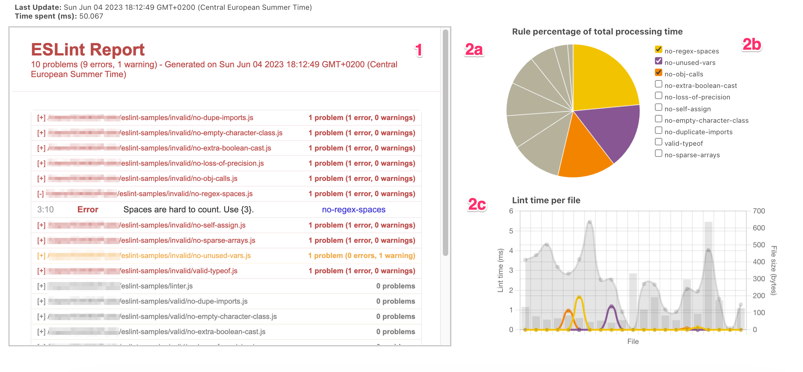

- Repo: eslint/eslint
- Start Date: 2023-03-10
- RFC PR: <https://github.com/eslint/rfcs/pull/108>
- Authors: Mara Nikola Kiefer (@mnkiefer)

# Performance Statistics

## Summary

<!-- One-paragraph explanation of the feature. -->

This document describes a new ESLint option `stats`, which enables the user to obtain a series of runtime *statistics* on top of their final lint results.

These statistics include more granular information, such as the [parse](#timing-parse)-, [fix](#timing-fix)-, and [lint-times](#timing-lint) and the number of [fix passes](#fix-passes), [directives and violations](#directives-and-violations) encountered.

| Stats |  | Description |
|--------|-------|---|
| **timing** | total  | The overall lint time that is spent on a file. This includes `parse-`, `fix-` and all `rules-` (total) times. |
|        | parse | The time that is spent when parsing a file, that is when [`parse()`](#timing-parse) or `parseForEslint()` is called. |
|        | rules | This is similar to the rule performance TIMING, except that it is more granular, that is, persisted as *per file per rule*.  |
| **passTiming** | | An array of *timing* objects for each of the [fix passes](#fix-passes). In total, these amount to the (total) *timing* object for the respective file. |
| **fixPasses** | | The number of times ESLint has applied at least one fix after linting. |
| **directives** | | Refer to [this issue comment](https://github.com/eslint/eslint/issues/14597#issuecomment-1003863524) |
| **violations** | | Refer to [this issue comment](https://github.com/eslint/eslint/issues/14597#issuecomment-1003863524) |

A *proof-of-concept* can be found at:
- [**ESLint**](https://github.com/mnkiefer/eslint/pull/1): **Fork of ESLint** on which the [detailed design](#detailed-design) (as described below) has been implemented.
- [**Sample project**](https://github.com/mnkiefer/eslint-samples): Example on which the dashboard (as depicted below) has been generated.

Below is an example of what the `stats` properties would look like (based on the sample project file `invalid/no-regex-spaces`). Each property will be addressed individually in the [Detailed Design](#detailed-design) section 2 ("Adding the `stats` option to Linter").
```json
{
    "stats": {
        "directives": 0,
        "violations": 0,
        "fixPasses": 0,
        "timing": {
            "rules": {
                "total": 1.650541,
                "no-regex-spaces": {
                    "total": 1.650541,
                    "create": 0.0435,
                    "Literal": 0.030583,
                    "CallExpression": 0,
                    "NewExpression": 1.576458
                }
            },
            "fix": 0,
            "parse": 1.911792,
            "total": 3.5623329999999997
        }
    }
}
```

A special [formatter](https://eslint.org/docs/latest/use/formatters/) `html-rule-performance` enables easy ingestion and interpretation of this data in form of a dashboard.

## Motivation

<!-- Why are we doing this? What use cases does it support? What is the expected
outcome? -->

An analysis of rule performance in ESLint can already be carried out by setting the [TIMING](https://eslint.org/docs/latest/extend/custom-rules#profile-rule-performance) environment variable. However, **additional scripting is still required** to collect/extract more *granular* timing data (lint time per file per rule) by following one of the two approaches:

1. Running ESLint per rule, per file and then collecting the file/rule time data output:

    ```bash
    TIMING=1 DEBUG=eslint:cli-engine eslint --no-eslintrc --rule ... file
    ```

2. Doing a single ESLint run on all files and then extracting the file/rule time data output:

    ```bash
    TIMING=all DEBUG=eslint:cli-engine eslint ... files
    ```

In addition, one needs to create an overview for an effective presentation of the results.

Since ESLint already collects most of this data internally, it would be more *convenient and shareable* to have:

   1. The **timing data** from ESLint exposed to the formatters.
   2. The possibility to also gain more insight into [other runtime statistics](https://github.com/eslint/eslint/issues/14597#issuecomment-1003863524) (not time related).
   3. A **built-in formatter** for a dashboard of that data.

## Detailed Design

<!--
   This is the bulk of the RFC.

   Explain the design with enough detail that someone familiar with ESLint
   can implement it by reading this document. Please get into specifics
   of your approach, corner cases, and examples of how the change will be
   used. Be sure to define any new terms in this section.
-->

------

1. **Adding the new `stats` option to ESLint:**

 - [_docs/src/use/command-line-interface.md_](https://github.com/mnkiefer/eslint/pull/1/files#diff-80937556f9a8e68352718255c20699fce061fa72760504c6accc3fc6b3b0613aR117): First, we document its *name* and *purpose* for the [Command Line Interface Reference](https://eslint.org/docs/latest/use/command-line-interface) under the *Miscellaneous* category.
     ```md
     --stats     Add additional statistics to lint results
     ```

 - [_lib/options.js_](https://github.com/mnkiefer/eslint/pull/1/files#diff-358c9491edc00f0db6f2f3c317df9aa932135803481b86c9289bd56bf8af0622R375-R3809): Now that the option has been documented, we add the `stats` option to ESLint's CLI options of type (`ParsedCLIOptions`):
     ```js
     {
         option: "stats",
         type: "Boolean",
         default: "false",
         description: "Add statistics to lint report"
     }
     ```

 - [_lib/cli.js_](https://github.com/mnkiefer/eslint/pull/1/files#diff-347ff93ed2b00c93c817863e32fbac5b4fac71d7339a48378980e682777689f4R96): The function `translateOptions(ParsedCLIOptions)` is called, so we add the `stats` option as an input parameter here too. We also ensure that the new formatter `html-rule-performance`cannot be called without the `stats` option turned on by throwing an error otherwise: `"The --stats option must be used to collect the statistics data for this formatter."`

 - [_lib/eslint/eslint.js_](): The function `processOptions(ESLintOptions)` is called, which is responsible for validating and normalizing options for the *ESLint* CLIEngine instance. Here, we add the `stats` option as a parameter to:
    <br>&nbsp;&nbsp;&nbsp;&nbsp;<a name="eslintjs-step1">Step 1</a>: The `processOptions` function and in that function set its default to `false` and make sure that a given value is always a boolean.
    <br>&nbsp;&nbsp;&nbsp;&nbsp;<a name="eslintjs-step2">Step 2</a>: The `ESLintOptions` type definition

 - [_lib/eslint/eslint-helpers.js_](https://github.com/mnkiefer/eslint/pull/1/files#diff-87d53094b12d82e4c11a0e1167d79cf2f471d2f5e5ebb6fc483e891f9dc87a5a): Similar to as we have done in [_eslint.js_ step 1](#eslintjs-step1) but for the *FlatESLint* CLIEngine instance.

- [_lib/eslint/flat-eslint.js_](https://github.com/mnkiefer/eslint/pull/1/files#diff-03dd66bfc8332edc2b145936aa2dd607ace1c34a31c222ec4d9617481876c27a): Similar to as we have done in [_eslint.js_ step 2](#eslintjs-step2) but for `FlatESLintOptions`. We also add the `stats` option to the function `verifyText(Object)` which returns the `LintResult` object. So, if `stats=true`, the `stats` properties (collected by the Linter) must be appended to the lint result:
     ```js
    if (stats) {
        result.stats = result.stats ? result.stats : {};
        result.stats.directives = linter.getDirectives().length;
        result.stats.violations = linter.getViolations().length;
        result.stats.fixPasses = fixPasses > 0 ? fixPasses : 0;
        const hasTiming = Object.keys(timing).length > 0;

        if (hasTiming) {
            result.stats.timing = {
                rules: hasTiming ? timing : {},
                fix: result.stats.fixTime || 0,
                parse: linter.getParseTime(),
                total: 0
            };
            result.stats.timing.total = result.stats.timing.parse + result.stats.timing.fix + result.stats.timing.rules.total;
        }
    }
     ```
    Note, that we have also adjusted the `linter.verifyAndFix()` input and output, which will be explained in the next section regarding changes to the Linter.

------

1. **Adding the `stats` option to Linter:**

    The following paragraphs describe the individual `stats` option properties, how they are collected and stored.<br>
    We will start by the exposure of the `timing` object, as most of the information is already collected by the Linter and just needs to be persisted.

  - [_shared/types.js](https://github.com/mnkiefer/eslint/pull/1/files#diff-28a93c0c2a90d26ab4f8007aed5c72473b5650f25dde18060bac60c1081a2767R188): We first document the new property by adding `timing` to the `LintResult` type definition.
     ```md
     * @property {number} [lintTime] Lint time of file
     ```

  - [_linter/timing.js_](https://github.com/mnkiefer/eslint/pull/1/files#diff-126a649c1db33de2cfe67b418435b10d45fc310143547e334f7be9a1a73c0901R142): The Linter collects the TIMING information in the `time(key, fn, filename, selector)` function where we have added two optional parameters to collect more granular information for the `filename` and `selector` for a given rule. We collect this information in a new Object `times` which is persisted in a new Map `lintTimesPerRule` under the key `"lintTimes"`. Finally, we add new function `timing.getLintTime()`, with which the Linter can collect the respective lint times.

  - [_linter/linter.js_](https://github.com/mnkiefer/eslint/pull/1/files#diff-a4ade4bc7a7214733687d84fbb54b625e464d13be7181caf54f564e5985db980R1117): When the `stats` option is enabled, the Linter class method `verifyAndFix()` adds the properties `fixPasses`, `fixTime` and `timing` to the `LintResult` object.
    1. *timing*: To collect the timing information, the Linter only calls `timing.time(ruleId, ruleListeners)` when `timing.enabled = true`. Hence, we add a condition here that the function is also called when `stats=true`. This, in turn, is called from `runRules()`, so we must add the `stats` option as an extra input parameter.
    2. *timing.parse*, *directives*, *violations*: For these properties, we and extend the `internalSlotsMap` and add helper functions respectively to store and later obtain them. The *parseTime* (`timing.parse`) is collected in the `parse()` function and returned as . The properties *directives* and *violations* are already collected by ESLint via `commentDirectives.directives` and `commentDirectives.problems` respectively and only need to be persisted.
    3. *fixPasses*: The *fixPasses* property is implemented and collected from the Linter method `verifyAndFix()`.

------
3. **Adding the formatter `html-rule-performance`:**

  - [_cli-engine/formatters/html-rule-performance](https://github.com/mnkiefer/eslint/pull/1/files#diff-95773f0fb81be14f3236b6c38be984f55ea5a741a1d6db0667a00514560b29d9): New file that provides a dashboard for the generated `stats` properties on the `LintResult` object.

    With the `stats` option and the formatter `html-rule-performance` enabled, the following dashboard can be automatically generated:

      

    The **Rule Performance Dashboard** consists of two parts:

    1. On the left hand side (**1**), we have the usual ESLint HTML report. Here, we have embedded the already established `html` formatter as a iframe with some small styling modifications. However, this report could have also been generated independently of another formatter but we have required it here to keep the code slim and focus on the charts.

    2. On the right hand side (**2**), we have the charts created by the [Chart.js](https://www.chartjs.org/) library. The first chart (**2a**) is a pie chart of the usual `TIMING` performance results the user is used to seeing from ESLint's stdout. The second chart (**2c**) contains the more detailed *per file per rule* information for each file (x-axis) and lint time (y-axis, left, line chart) per rule as well as the the respective file size (y-axis, right, bar chart).The file sizes and the total lint times are shown in the background in gray, while the individual rule lint times are shown as colored lines. Note, that both charts will update on changes to the rule selection checkbox menu (**2b**, top right corner of the screen) such that one can easily view and compare different rule (times) across all files, which can help to detect more intricate performance issues that may be overlooked otherwise (based on rule reports or average values across entire runs only).

    The above dashboard stems from an ESLint run on the [sample project](https://github.com/mnkiefer/eslint-samples) with 20 `*.js` files of 10 valid/invalid [recommended rules](https://eslint.org/docs/latest/rules/) examples (as taken from [ESLint's Rule Documentation](https://eslint.org/docs/latest/rules/) examples).

------

## Documentation

<!--
    How will this RFC be documented? Does it need a formal announcement
    on the ESLint blog to explain the motivation?
-->

This RFC relates to two sections.

- In the [Profile Rule Performance](https://eslint.org/docs/latest/extend/custom-rules#profile-rule-performance) section, it could be mentioned that the formatter `html-rule-performance` may help to depict and more closely analyse the results.

- The [Formatters](https://eslint.org/docs/latest/use/formatters/) section should include the formatter `html-rule-performance`.

## Drawbacks

<!--
    Why should we *not* do this? Consider why adding this into ESLint
    might not benefit the project or the community. Attempt to think
    about any opposing viewpoints that reviewers might bring up.

    Any change has potential downsides, including increased maintenance
    burden, incompatibility with other tools, breaking existing user
    experience, etc. Try to identify as many potential problems with
    implementing this RFC as possible.
-->

- Current implementation uses third party library [Chart.js](https://www.chartjs.org/)@4.2.1
-  Adding a new built-in formatter for a **Rule Performance Dashboard** may be redundant as the UI and design is dependant on use cases and personal preference.

## Backwards Compatibility Analysis

<!--
    How does this change affect existing ESLint users? Will any behavior
    change for them? If so, how are you going to minimize the disruption
    to existing users?
-->

- The current ESLint users should not be affected by these changes, as the statistics are only collected when `--stats` is enabled.

## Alternatives

For performance analyses prior to this implementation of this dashboard, a series of eslint calls (or a series of processing steps) as well as creation of a custom UI was necessary to derive and then depict the more detailed `TIMING` information to monitor and quickly get an overview of the individual rule's lint time evolution.

## Open Questions

<!--
    This section is optional, but is suggested for a first draft.

    What parts of this proposal are you unclear about? What do you
    need to know before you can finalize this RFC?

    List the questions that you'd like reviewers to focus on. When
    you've received the answers and updated the design to reflect them,
    you can remove this section.
-->

- Is the inclusion of Chart.js acceptable or should custom UI/Charts be created for ESLint to use?
- Should the HTML page be adaptable to smaller media devices?

## Help Needed

<!--
    This section is optional.

    Are you able to implement this RFC on your own? If not, what kind
    of help would you need from the team?
-->

More detailed requirements and feedback from the ESLint team would be necessary to implement this feature.

## Frequently Asked Questions

<!--
    This section is optional but suggested.

    Try to anticipate points of clarification that might be needed by
    the people reviewing this RFC. Include those questions and answers
    in this section.
-->

> "Why do we need a new built-in formatter?"

Although everyone probably wants to create their own dashboard, it is still time consuming and cumbersome to do so. If `html-rule-performance` was offered, the user still as the option to just use it as is, or copy it and adapt his custom formatter from there.

## Related Discussions

<!--
    This section is optional but suggested.

    If there is an issue, pull request, or other URL that provides useful
    context for this proposal, please include those links here.
-->

- See related issue: https://github.com/eslint/eslint/issues/16690