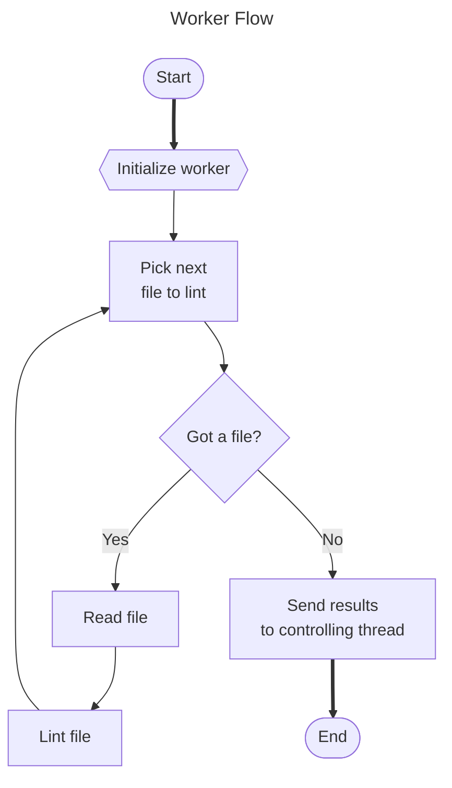

- Repo: [eslint/eslint](https://github.com/eslint/eslint)
- Start Date: 2024-12-20
- RFC PR: https://github.com/eslint/rfcs/pull/129
- Authors: Francesco Trotta ([fasttime](https://github.com/fasttime))

# Multithread Linting

## Summary

<!-- One-paragraph explanation of the feature. -->

Introduce the ability lint files concurrently on multiple threads.

## Motivation

<!-- Why are we doing this? What use cases does it support? What is the expected
outcome? -->

The aim of multithread linting is to speed up ESLint by distributing the workload across multiple CPU cores as explained in eslint/eslint#3565.
This targets the typical case for ESLint where performance is limited by processor speed on a system with fast I/O peripherals.

## Detailed Design

<!--
   This is the bulk of the RFC.

   Explain the design with enough detail that someone familiar with ESLint
   can implement it by reading this document. Please get into specifics
   of your approach, corner cases, and examples of how the change will be
   used. Be sure to define any new terms in this section.
-->

This document proposes adding a new multithread mode for [`ESLint#lintFiles()`](https://eslint.org/docs/latest/integrate/nodejs-api#-eslintlintfilespatterns).
In multithread mode, a predefined number of worker threads are spawn and will run concurrently to read and lint files.

Multithread mode will be enabled when a new constructor option `concurrency` is specified.
This option controls the number of linting threads to use, and defaults to the value `"off"` for no multithreading (the current behavior).
Other possible values are positive integers to specify the number of linting threads explicitly, or the value `"auto"` that will attempt to choose the best settings automatically.
It will be also possible to specify the new option on the command line as `--concurrency`.

Multithread mode comes with some important limitations for values that can be used as constructor options ([Limitations for Constructor Options](#limitations-for-constructor-options)).
It may also require loosening some constraints about errors ([Error Management](#error-management)) and rethinking the implementation of the API method [`ESLint#getRulesMetaForResults()`](#eslintgetrulesmetaforresults).
The aim of these modifications is to ensure that users receive consistent results, irrespective of the concurrency settings employed.
Most importantly, the lint results should not change.

### Design Goals

The proposed design focuses on enhancing performance by minimizing resource locking and limiting cross-thread communication to the essential minimum. 

Another goal keeping the experience as simple as possible for users.
Ideally, users should be able to execute `eslint --concurrency=auto`, allowing ESLint to automatically determine the optimal settings.

### Limitations for Constructor Options

JavaScript offers no mechanism to access arbitrary objects from multiple threads.
This means that when concurrency is enabled, each linting thread must receive its own deep clone of the options passed to the `ESLint` constructor.
The fact that options must be cloned brings in an important limitation: only [_serializable_](https://html.spec.whatwg.org/multipage/structured-data.html#serializable-objects) data can be cloned and shared across threads.
Serializable objects may not contain certain values; most notably, they may not contain functions[^1].
This restricts some ESLint options from accepting unserializable values when concurrency is enabled.
The restriction applies to the following options:

* `baseConfig` (can contain unserializable values)
* `overrideConfig` (can contain unserializable values)
* `plugins` (can contain unserializable values)
* `ruleFilter` (can be a function)
* `fix` (can be a function)

If one of the above options is assigned an unserializable value, that value will not be accessible outside the controlling thread.
Still it is not always possible to find serializable replacements.

Overcoming this limitation is the most challenging part of the multithread linting implementation.

<a name="option-modules"></a>
#### Solution for Unserializable Options: Option Modules

One potential alternative to directly passing unserializable options to the `ESLint` constructor is to export these options from a module.
This module will be uniquely identified by a (serializable) URL, and only this URL will have to be passed to worker threads.
The module can be either a file or a memory module (**note**: Node.js can only import modules with the schemes `file`, `data`, and `node`[^2]; other runtimes like Deno also support `blob` and `http`/`https`).
This solution is specifically conceived for API consumers, but it can be readily adapted to handle the case where ESLint is executed from the command line.

In order to let API consumers load those options and create an `ESLint` instance, a new static method will be added to the `ESLint` class.
The new method `fromOptionModule` could be used by API consumers to create an instance of `ESLint` from arbitrary, unserializable options:

```js

const disableSerializabilityCheck = Symbol("Do not check for unserializable options.");

async function loadOptionsFromModule(optionsURL) {
    return optionsURL ? (await import(optionsURL)).default : {};
}

// ...

class ESLint {
    // ...

    #optionsURL;

    static async fromOptionModule(optionsURL) {
        const options = await loadOptionsFromModule(optionsURL);

        options[disableSerializabilityCheck] = true;
        const eslint = new ESLint(options);
    
        // Save `optionsURL` in an instance field so it can be passed to worker threads in `lintFiles()`.
        eslint.#optionsURL = String(optionsURL);
        return eslint;
    }

    // ...
}
```

Note that `optionsURL` is not a constructor option, it's an additional argument passed to the worker threads in lieu of the options.
Linting threads must load the module specified by `optionsURL` asynchronously by calling `loadOptionsFromModule()` just like the controlling thread, with the difference that linting threads don't have to create an `ESLint` instance.

To understand the impact of this change for API consumers, consider for example the following code where the `ESLint` constructor is invoked with an unserializable value for the `fix` option:

```js
const eslint = new ESLint({
    fix: ({ ruleId }) => ruleId !== null && !ruleId.includes("/") // Fix only built-in rules.
});
```

If the `concurrency` option is added, an error will occur when the constructor is invoked:

```js
const eslint = new ESLint({
    concurrency: 2,
    fix: ({ ruleId }) => ruleId !== null && !ruleId.includes("/") // Fix only built-in rules.
});
// Error: Unserializable options not allowed with "concurrency"
// Found unserializable options: "fix"
```

In order to use a `fix` function along with the `concurrency` options, consumers will have to use the asynchronous `fromOptionModule()` method like this:

```js
const eslint = await ESLint.fromOptionModule(
    new URL("./options.js", import.meta.url)
);
```

And in a separate file named `options.js`:

```js
export default {
    concurrency: 2,
    fix: ({ ruleId }) => ruleId !== null && !ruleId.includes("/") // Fix only built-in rules.
};
```

Instead of creating a file to specify unserializable options, it's also possible to specify a module using a data URL:

```js
const optionsSrc = `
    export default {
        concurrency: 2,
        fix: ({ ruleId }) => ruleId !== null && !ruleId.includes("/") // Fix only built-in rules.
    };
`;
const eslint = await ESLint.fromOptionModule(`data:text/javascript,${encodeURI(optionsSrc)}`);
```

#### Solution for CLI Options

In the existing ESLint architecture, command-line arguments are first mapped to an intermediate data structure where option values can be a boolean, a string, a number or an array ([`ParsedCLIOptions`](https://github.com/eslint/eslint/blob/v9.15.0/lib/options.js#L18-L65)).
This is done using the `optionator` dependency in `lib/cli.js`.
In a next step, the options in this intermediate data structure are converted to actual `ESLint` constructor options by calling the [`translateOptions()`](https://github.com/eslint/eslint/blob/v9.15.0/lib/cli.js#L97-L209) function also in `lib/cli.js`.

The intermediate data structure is always serializable; the `ESLint` constructor options are not.
When ESLint is launched from the CLI with the `--concurrency` option, a possible approach to share options with worker threads is passing the intermediate structure options and calling `translateOptions()` in each tread to obtain the same constructor option in each thread.

In a different but related approach we could leverage [option modules](#option-modules) as described in the previous section to call `translateOptions()` on the serialized, intermediate structure options.
To do so, the [`engine` calculation](https://github.com/eslint/eslint/blob/v9.15.0/lib/cli.js#L486-L487) in `cli.execute()` could be changed from

```js
        const eslintOptions = await translateOptions(options, usingFlatConfig ? "flat" : "eslintrc");
        const engine = new ActiveESLint(eslintOptions);
```

to

```js
        let engine;
        if (options.concurrency && options.concurrency !== "off") {
            const eslintHelpersURL = new URL("./eslint/eslint-helpers.js", import.meta.url);
            const optionsSrc = `
                import { translateOptions } from ${JSON.stringify(eslintHelpersURL)};
                const cliOptions = ${JSON.stringify(options)};
                export default translateOptions(cliOptions);
            `;
            engine = await ESLint.fromOptionModule(`data:text/javascript,${encodeURI(optionsSrc)}`);
        }
        else {
            const eslintOptions = await translateOptions(options, usingFlatConfig ? "flat" : "eslintrc");
            engine = new ActiveESLint(eslintOptions);
        }
```

### New `concurrency` Option

Multithread linting is controlled by a new `concurrency` option of the `ESLint` constructor (`--concurrency` for the CLI). The possible values for this options are:

* `"off"`: No multithreading, run as usual (this is the default)
* Integers ≥ 1: The number of linting threads
* `"auto"`: Choose the best setting automatically

#### Concurrency `"auto"`

When `auto` concurrency is selected, ESLint will use a heuristic to determine the best concurrency setting, which could be any number of threads or also `"off"`.
An approach I have tested is using half the number of available CPU cores, which is a reasonable starting point for modern machines with many (4 or more) cores and fast I/O peripherals to access the file system.
But linting time also depends on the features of the project like the configuration or the number of files.
Some plugins like typescript-eslint with type-aware linting can increase the time required to initialize a linting thread resulting in additional per-thread overhead.

We can start by using this heuristic, and indicate in the documentation that manually adjusting the concurrency level may yield better performance.

### ESLint Constructor

The `ESLint` constructor, or more accurately the [`processOptions`](https://github.com/eslint/eslint/blob/v9.15.0/lib/eslint/eslint-helpers.js#L700-L869) helper function, should be updated to recognize and validate the new [`concurrency` option](#new-concurrency-option).

When `concurrency` is set to a value other than `"off"`, the constructor must ensure that all options are serializable, and if some of them are not, an error will be thrown with the names of options that cannot be serialized.
This serializability check should only be turned off when the constructor is called by the `fromOptionModule` method.
This method stores the option URL used to load the options so that only this URL must be passed to worker threads, while the `options` object doesn't have to be cloned.
To disable the serializability check in the constructor, `fromOptionModule` will set a property with a specific symbol key in the options object. This symbol is not exposed by the API.

The new serializability check in the constructor will only run when `concurrency` is set to a value other than `"off"`.
It will look roughly like this:

```js
        if (!options[disableSerializabilityCheck] && !isSerializable(options)) {
            const unserializableKeys = Object.keys(options).filter(key => !isSerializable(options[key]));

            if (unserializableKeys.length) {
                throw new Error(`Unserializable options not allowed with "concurrency"\nFound unserializable options: ${
                    new Intl.ListFormat('en-US').format(unserializableKeys.map(key => `"${key}"`))}
                `);
            }
        }
```

The `isSerializable` function is defined from the requirements for serializable objects.
Trivially, one could call `structuredClone()` or [`v8.serialize()`](https://nodejs.org/docs/latest-v18.x/api/v8.html#v8serializevalue) on a specified value and if an error is caught, assume that the value is unserializable.
If there is a more correct implementation we could use that one instead.
`JSON.stringify` cannot be used because it simply ignores unserializable values.

### `ESLint#lintFiles()`

The core of this proposal aims at providing an alternative implementation for the `ESLint#lintFiles()` method, or more exactly for the inner part of that method, after files are enumerated and before the cache is saved.
See the [_relevant code_](https://github.com/eslint/eslint/blob/v9.15.0/lib/eslint/eslint.js#L747-L839) in `lib/eslint/eslint.js`.

The new multithread implementation will exist alongside the current, single-thread implementation, and it will only be used when multithreading mode is enabled.

In the multithread implementation `lintFiles()` launches as many worker threads as specified by the `concurrency` option, but no more than the number of enumerated files.
All worker threads receive the same parameters from the controlling thread:
* the list of enumerated file paths
* a reference to shared memory containing the index of the next file to be processed in the list (a `TypedArray` with an underlying `SharedArrayBuffer`)
* only one of the following:
  * the serializable `ESLint` options
  * the URL of an [option module](#option-modules)
  * _possibly_ the parsed CLI options, depending on the chosen [solution for CLI options](#solution-for-cli-options)

Each worker thread repeatedly reads and lints a single file until all files have been linted or an abort signal is triggered.
Errors in worker threads are not caught: they will be intercepted as error events by the controlling thread where they will trigger an abort signal that causes all other threads to exit.

The controlling thread itself does not lint any files: it waits until all files are linter or an error occurs.
When a worker thread terminates successfully it submits a list of `LintReport`s to the controlling thread. Each result is enriched with the index of the associated file.
The controlling thread collects the lists of `LintReport`s and merges them in the expected order, then populates `lintResultCache` with cache information (**note**: this is different from the single-thread implementation where the cache is populated progressively as files are being linted).
From this point onwards the multithread implementation converges with the single-thread one.
The next common step is saving the cache to a file.

A simplified prototype implementation of the multithread logic in `lintFiles()` would look like the following:

```js
        const {
            cacheFilePath,
            configLoader,
            lintResultCache,
            options: eslintOptions
        } =
        privateMembers.get(this);

        // Create results array.
        const results = Array(filePaths.length);

        // Calculate effective concurrency.
        const concurrency = Math.min(eslintOptions.concurrency, filePaths.length);
        debug(`Running ${concurrency} worker thread(s).`);

        // Start worker threads.
        const abortController = new AbortController();
        const fileIndexCounter = new Int32Array(new SharedArrayBuffer(Int32Array.BYTES_PER_ELEMENT));
        const workerPath = require.resolve("./worker.js");
        const workerOptions = {
            workerData: {
                filePaths,
                fileIndexCounter,
                eslintOptions
            },
        };
        const workerExecutor = function (resolve, reject) {
            const worker = new Worker(workerPath, workerOptions);

            // A message is only received once when the thread exist successfully.
            worker.once(
                "message",
                indexedResults => {
                    for (const result of indexedResults) {
                        const { index } = result;
                        delete result.index;
                        results[index] = result;
                    }
                    resolve();
                }
            );
            worker.once(
                "error",
                error => {
                    abortController.abort(error);
                    reject(error);
                }
            );
            abortController.signal.addEventListener("abort", () => worker.terminate());
        };
        const promises = new Array(concurrency);

        for (let index = 0; index < concurrency; ++index) {
            promises[index] = new Promise(workerExecutor);
        }

        // Wait until all results have been collected.
        await Promise.all(promises);

        // Persist the cache to disk.
        if (lintResultCache) {
            results.forEach((result, index) {
                if (result) {
                    const filePath = filePaths[index];
                    const configs = configLoader.getCachedConfigArrayForFile(filePath);
                    const config = configs.getConfig(filePath);

                    lintResultCache.setCachedLintResults(filePath, config, result);
                }
            );
            lintResultCache.reconcile();
        }
```

### Worker threads

In JavaScript, threads have separate execution contexts and access separate memory.
This allows diferent threads in the same process to efficiently run on different cores without locking each other.
The thread's entry point is a module specifier (path or URL) that is loaded as soon as the thread starts.

For the purpose of multithread linting, all linting threads are created by the controlling thread at the same time before the linting process starts.
Although the controlling thread will be typically the main thread of the process, this is not a general requirement.
Some tools do use the `ESLint` API in a worker thread, and this usage will remain possible with mulithread linting enabled.
The number of linting threads is determined in advance by the `concurrency` option.
The lifetime of a worker thread can be roughly divided into an initialization phase where the environment is set up and an iteration phase where the threads concur to read and line files repeatedly, one file per thread at a time.



Note that Worker threads do not need to instantiate or otherwise access the `ESLint` class like API consumers do.
The bulk of the worker thread implementation could be done in a new, separate class, while common functionality could be extracted to a shared module.

#### Initialization Phase

All threads start in the same state with exactly the same parameters and the same entry point.
Worker threads are not aware of each other.

Once a worker thread starts, it will first attempt to enable compile cache by calling [`module.enableCompileCache()`](https://nodejs.org/api/module.html#moduleenablecompilecachecachedir) if available (The compile cache must be enabled separately for each thread).

The next important step is determining the `ESLint` constructor options to use.
Recall that `ESLint` constructor options could be passed to worker threads in several proposed ways (see [option modules](#option-modules) and [solution for CLI options](#solution-for-cli-options)).
Unless options were passed directly as a serializable object, they must be loaded asynchronously first.

#### Iteration Phase

The main task of a thread is reading and linting files.

When threads are created, they all receive a copy of the same list of files to lint.
To ensure that each file is only linted by one thread, a shared counter is used: this shared counter is created by the controlling thread and passed as a parameter to all worker threads.
The counter contains the index of the next file to be linted in the list of files, starting from 0.
Its value is read and incremented using a non-blocking atomic operation.

```js
const fileIndex = Atomics.add(fileIndexCounter, 0, 1);
const file = filePaths[fileIndex];
if (file) {
    // Read and lint file...
} else {
    // No more files to lint, exit.
}
```

This counter is the only means to track the progress during linting: no other information is shared across worker threads or with the controlling thread until the linting terminates or an error occurs.
This design ensures that no thread needs to block waiting for information from another thread.

It isn't necessary to create a new `ESLint` instance from the options, in fact worker threads will not use the `ESLint` class.
Instead, in order to lint the content of file, only the function `verifyText()` will be called, as it is currently the case.

```js
                        // do the linting
                        const result = verifyText({
                            text,
                            filePath,
                            configs,
                            cwd,
                            fix: fixer,
                            allowInlineConfig,
                            ruleFilter,
                            stats,
                            linter
                        });
```

from https://github.com/eslint/eslint/blob/v9.15.0/lib/eslint/eslint.js#L809-L820

Now, this function is only accessible from inside `lib/eslint/eslint.js` where it is currently defined.
In order to reuse it in a similar way from a worker thread, it will be extracted to a new module `lib/eslint/verify-text.js` and exported from there for internal use only.

#### One File per Thread vs. Many Files per Thread

In the proposed implementation, each thread processes one file at a time, selecting the subsequent file only after completing the current one. 
However, from a technical standpoint, there is no necessity to restrict the operation to a single file.
Theoretically, it is conceivable that allowing threads to process multiple files concurrently could enhance the utilization of CPU time.
When handling multiple files, a thread that is waiting for an asynchronous I/O operation on one file could continue its execution by linting another file instead of relinquishing its time slice to the scheduler, thereby avoiding the cost of an additional context switch.
I run a few prototypes to evaluate the effects of linting multiple files compared to the single-file approach; however, I was unable to identify any significant improvements for any setup.
Consequently, I opted to simplify the implementation by processing one file at a time.
We could still revisit the effects of processing multiple files in more detail when the RFC is implemented.

### `ESLint#getRulesMetaForResults()`

A caveat we haven't considered yet is the `ESLint` method [`getRulesMetaForResults()`](https://eslint.org/docs/latest/integrate/nodejs-api#-eslintgetrulesmetaforresultsresults).
Some API consumers will call this method after invoking `lintFiles()` or `lintText()` in order to get additional information.
For this information to be returned, all config files must have been loaded by the time `getRulesMetaForResults()` is called.
The reason is that `getRulesMetaForResults()` is a synchronous method: it cannot load config files asynchronously, so it expects to find the config arrays already cached.
This is always the case when `lintFiles()` was used to lint files in the current implementation, but if `lintFiles()` operates in multithread mode, the config files are loaded in a worker thread.
Returning a config array to the controlling thread is not an option, because it could be unserializable, so we need a workaround.

#### Solution 1: Preload config arrays in the controlling thread

A possible solution is loading config files in the controlling thread while waiting for worker threads to finish.
Loading config files should be relatively fast, but it will slightly degrade linting performance by competing for resources with the worker threads.

The disadvantage of this solution is that it will always cause additional work in the controlling thread, even if the config files won't be used.
Apart from `getRulesMetaForResults()` config files are used (and loaded) when the cache is enabled.
This means that if the cache is not enabled and `getRulesMetaForResults()` is never called, the config files will be loaded unnecessarily.

#### Solution 2: Merge precalculated rules meta in the controlling thread

Another possible solution is retrieving rules `meta` objects in each worker thread and returning this information to the controlling thread.
When `getRulesMetaForResults()` is called in the controlling thread, rules `meta` objects from all threads will be deduped and merged and the results will be returned synchronously.

This solution removes the need to load config files in the controlling thread but it still requires worker threads to do potentially useless work by adding an extra processing step unconditionally.
Another problem is that rules `meta` objects for custom rules aren't always serializable.
In order for `meta` objects to be passed to the controlling thread, unserializable properties will need to be stripped off, which is probably undesirable.

#### Solution 3: Provide an async alternative to `getRulesMetaForResults()`

An async variant of `getRulesMetaForResults()`, call it `getRulesMetaForResultsAsync()`, could load config files asynchronously as required before calculating rules `meta` objects.

Using this async method would avoid the need to do potentially useless work in advance which is expected by the other solutions.
The drawback is that consumers that call `getRulesMetaForResults()` will need to switch to `getRulesMetaForResultsAsync()` if they want to support the new multithread mode.

### Error Management

When an error is thrown during a call to `ESLint#lintFiles()`, the observable effect depends on where it happens:

* Errors thrown while loading config files are not caught, they are reported unchanged to the caller.
* Problems in the config file such as invalid properties result in a `TypeError` with a `cause` property being thrown when the config is loaded.
  See the [_relevant code_](https://github.com/eslint/eslint/blob/ec928136576572a6841d238b7e41ac976d27c687/lib/config/flat-config-array.js#L64-L67) in `lib/config/flat-config-array.js`.
* Errors thrown in a processor's `postprocess()` function or in a rule's `create` method are reported unchanged to the caller.
* Errors thrown in a visitor are enriched with additional information like the rule's name and the AST and then rethrown.
* Errors thrown in a processor's `preprocess()` function or inside a parser are caught and refleted as linting problems for a file (fatal errors).

This will remain the same when running in multithread mode, except that errors can occur independently in the controlling thread or in any worker thread.
The general strategy is to stop all linting thread as soon as an uncaught error occurs and reject the call to `lintFiles()` with the first reported error.

The controlling thread will use an [`error`](https://nodejs.org/docs/latest-v18.x/api/worker_threads.html#event-error) event handler to intercept errors thrown from worker threads.
The [`terminate()`](https://nodejs.org/docs/latest-v18.x/api/worker_threads.html#workerterminate) method can be used to terminate other worker threads when an error occurs.
Another option is posting a message to a [`BroadcastChannel`](https://developer.mozilla.org/en-US/docs/Web/API/BroadcastChannel) requesting all threads to gently terminate.

Errors created in a worker thread cannot be cloned to the controlling thread without changes, because they can contain unserializable properties.
Instead, Node.js creates a serializable copy of the error, stripped off of unserializable properties, and reports it to the controlling thread as a paremeter of the [`error`](https://nodejs.org/docs/latest-v18.x/api/worker_threads.html#event-error) event.
During this process `message` and `stack` are preserved because they are strings.
The error's type is only preserved for the built-in error types `Error`, `EvalError`, `RangeError`, `ReferenceError`, `SyntaxError`, `TypeError` and `URIError`[^3].
Other error types will result in an error of a built-in type if they inherit from a built-in error in their prototype chain.
Otherwise, the thrown value is converted into a string.

This strategy comes with some unobvious implications that consumers should be aware of:

* Errors thrown by `lintFiles()` could be of a different type than the errors thrown when running in single-thread mode, and they may leak unserializable properties.
* Because of race conditions, subsequent calls to `lintFiles()` could produce different errors for identical input.

### Warning Management

In certain scenarios, ESLint issues warnings to notify users of possible problems.
Unlike errors, warnings do not halt the execution of ESLint.
As a result, the same warning may be printed multiple times if not handled carefully, and this situation becomes further complicated when multiple threads are in play.

The following sections describe possible warnigns and the strategy to control how they are reported in multithread mode.

#### Eslintrc Configuration Warnings

The ESLint CLI emits a warning when the user enables legacy eslintrc configuration system by setting the environment variable `ESLINT_USE_FLAT_CONFIG` to `false`.
This warning is only emitted in the process' main thread and it doesn't need any special handling.

#### ".eslintignore" File Warnings

The `ESLint` constructor emits a warning when it detects an `.eslintignore` file in the current directory, as specified by the `cwd` option.
Per this RFC, the `ESLint` class is not used by linting threads, so no special handling is required.

#### Inactive Flag Warnings

The `Linter` class emits a warning for each inactive flag used.

Because `Linter` objects are created with the same options both in the controlling thread and in linting threads, it is sufficient to suppress warnings in linting threads to ensure that the these warnings are printed exactly once, just in the controlling thread.
This could be done by passing a `warningEmitter` object with a method `emitInactiveFlagWarning` to the linter, with different implementations for the controlling thread and worker threads.
This object will only affect the behavior of the `Linter` constructor, so it doesn't need to be stored in instances of the `Linter` class along with the other public options.
The `warningEmitter` object will be passed to the `Linter` by the `ESLint` instance, and it will default to a standard implementation that always emits warnings.

#### Empty Configuration File Warnings

Empty config files and config files that export an empty array trigger a warning when they are loaded.
The warning is emitted once per each empty config file.

In multithread mode, config files will be always loaded by one or more worker threads, but they may or may not be loaded by the controlling thread.
To ensure that each warning related to an empty config file is printed exactly once, a new option `warningEmitter` will be added to `ConfigLoader`.
The value of this option will be an object with a method `emitEmptyConfigFileWarning`, with different implementations for single-thread mode, multithread mode in the controlling thread, and multithread mode in worker threads.
Instead of calling `process.emitWarning()` directly, the `ConfigLoader` will call this new method.
When running in a worker thread, the new method will submit the name of the config file to the controlling thread, either using the worker's own `MessageChannel` or with a dedicated `BroadcastChannel`.
The warnings will be collected by the controlling thread, which will call its own implementation of `emitEmptyConfigFileWarning`.
The controlling thread implementation will keep track of warnings that were already emitted using a `Set` to make sure that they are not re-emitted.

#### Circular Fixes Warnings

Warnings about circular fixes/conflicting rules are emitted by the linter on a per-file each basis.
Since each file is linted only once, these warnings will not be repeated, even if they originate from different threads.

#### Other Warnings

Warnings generated by plugins or other tools will be emitted unfiltered.
It will be the responsibility of each plugin to avoid duplicated warnings in multithread mode.

### Tests

New scenarios to be tested include cases where ESLint is launched from the CLI with the `--concurrency` flag, and usages of `ESLint#lintFiles()` with the `concurrency` option.

## Documentation

<!--
    How will this RFC be documented? Does it need a formal announcement
    on the ESLint blog to explain the motivation?
-->

The new `concurrency` option should be documented in the [CLI options](https://eslint.org/docs/latest/use/command-line-interface#options) and in the [`ESLint` constructor options](https://eslint.org/docs/latest/integrate/nodejs-api#-new-eslintoptions).
A blog post to introduce the new feature would be also good.

## Drawbacks

<!--
    Why should we *not* do this? Consider why adding this into ESLint
    might not benefit the project or the community. Attempt to think 
    about any opposing viewpoints that reviewers might bring up. 

    Any change has potential downsides, including increased maintenance
    burden, incompatibility with other tools, breaking existing user
    experience, etc. Try to identify as many potential problems with
    implementing this RFC as possible.
-->

### Added Complexity

The new feature will introduce additional complexity, especially because of [option modules](#option-modules).

### False Expectations

There is a legitimate concern that multithread mode may in fact make linting slower in some scenarios because of the extra overhead to initialize each thread.
This is definitely the case as it has been reported for various related tools.

* pgAdmin/eslint-parallel#4
* pinterest/esprint#126
* pinterest/esprint#166
* origin-1/eslint-p#3

Especially plugins that require a longer initialization time, such as typescript-eslint, will be affected by this problem.
While several solutions have been proposed to mitigate this issue, discussing them would exceed the scope of this proposal.
To avoid establishing false expectations, it would make sense to include a note regarding the potential performance degradation in the documentation or perhaps to issue a runtime warning.
The recommendation will be to enable multithread linting only when it performs measurably faster than linting in single-thread mode.

### Multifile Analysis

Another concern with multithread linting is that it could make the implementation of multifile analysis harder, as described in [this blog](https://jfmengels.net/multi-file-analysis/).
Currently, files in ESLint are processed one by one without mutual knowledge.
There is however an ongoing discussion about introducing [_project-aware linting_](https://github.com/eslint/eslint/discussions/16819), which would largely benefit plugins such as `typescript-eslint` that require analyzing muliple files at once to function correctly.

## Backwards Compatibility Analysis

<!--
    How does this change affect existing ESLint users? Will any behavior
    change for them? If so, how are you going to minimize the disruption
    to existing users?
-->

When the `concurrency` option is not used, nothing will change.
When the `concurrency` option is used, some things will change:
* Unserializable `ESLint` constructor options will throw an error. This does not affect CLI options.
* Some errors thrown by `ESLint#lintFiles()` could be different (see [error management](#error-management)).
* Tools that rely on `ESLint#getRulesMetaForResults()` may start behaving incorrectly, depending on the approach chosen in [`ESLint#getRulesMetaForResults()`](#eslintgetrulesmetaforresults).
* typescript-eslint will still work, but if type-aware linting is used there will be considerable additional overhead because each thread needs to load the TypeScript project.

## Alternatives

<!--
    What other designs did you consider? Why did you decide against those?

    This section should also include prior art, such as whether similar
    projects have already implemented a similar feature.
-->

There is probably no single alternative that would address all use cases considered in this document.
However some of the problems tackled in this RFC can be solved in different ways.
Some of these alternatives are described closer in the single sections of this RFC.

For a tool, the alternative I looked into more closely is [Trunk Code Quality](https://trunk.io/code-quality), one of the tools used to build ESLint.
Trunk is able to parallelize the lint process by splitting ESLint runs over multiple processes.
However, it does so in a way that makes it difficult to collect the lint results in the end of the process.
This ability is essential for many core functionalities to work, for example formatters.
Also Trunk does not offer an API similar to ESLint to control the lint process programmatically.

Another interesting tool is a fork of ESLint v8 with parallel linting support shared by [faultyserver](https://github.com/faultyserver)[^4].
This tool only supports eslintrc configuration which makes it challenging to directly compare the results with the current single-thread implementation.

## Open Questions

<!--
    This section is optional, but is suggested for a first draft.

    What parts of this proposal are you unclear about? What do you
    need to know before you can finalize this RFC?

    List the questions that you'd like reviewers to focus on. When
    you've received the answers and updated the design to reflect them, 
    you can remove this section.
-->

* How to serialize CLI options? (see [Solution for CLI Options](#solution-for-cli-options) for a proposed solutions).
* How to fix `ESLint#getRulesMetaForResults()` to support multithreading? (see proposed solutions in [`ESLint#getRulesMetaForResults()`](#eslintgetrulesmetaforresults)).

## Help Needed

<!--
    This section is optional.

    Are you able to implement this RFC on your own? If not, what kind
    of help would you need from the team?
-->

## Frequently Asked Questions

<!--
    This section is optional but suggested.

    Try to anticipate points of clarification that might be needed by
    the people reviewing this RFC. Include those questions and answers
    in this section.
-->

**Q: Why worker threads and not a process cluster?**

A: Worker thread are less resources intensive than process clusters.
They also allow for more efficient communication mechanisms like `Atomics`, whereas Node.js process must use IPC channels to exchange information.

**Q: What performance improvement can be expected?**

A: I don't have great results to share at this time.
The performance change depends on hardware factors, on the ESLint configuration and on the concurrency settings.
The tests I conducted on a limited number of setups indicate a reduction of the overall linting time ranging up to 75% for linting larger JavaScript repos like `eslint` on an 8-core M3 machine, but it's very well possible for multithread linting to have a negative impact on performance in certain cases.

In general, the performance improvement will be larger for:

* Faster I/O devices
* More CPU cores
* Slower CPUs
* More files to lint
* Faster initializing configurations
* Computation-intensive parsers and rules
* No cache

**Q: What will happen to the bounty?**

A: Issue eslint/eslint#3565 has a $500 bounty associated.
As an ESLint team member, I do not qualify to claim the bounty.
However, if this RFC is approved, it will be the responsibility of the Technical Steering Committee to decide on the appropriate course of action concerning the bounty.
An option that seems fair is moving the bounty to another issue that needs attention from the community.

## Related Discussions

<!--
    This section is optional but suggested.

    If there is an issue, pull request, or other URL that provides useful
    context for this proposal, please include those links here.
-->

* Tracking issue eslint/eslint#3565
* Prior parallel linting proposals
  * eslint/rfcs#4
  * eslint/rfcs#11
  * eslint/rfcs#42

## Related Tools

The following is a list of tools that have implemented ESLint parallelization using multiple threads or processes.

**[eslint-parallel](https://github.com/pgAdmin/eslint-parallel)**

A tool with parallel linting support based on ESLint v6.
It launches multiple sub-processes where each sub-process lints a precomputed subset of files.
It provides a programmatic API as well as a command line interface.

**[esprint](https://github.com/pinterest/esprint)**

A tool with parallel linting support based on ESLint v7.
It starts a worker thread pool, calling `ESLint#lintFiles()` once for each file in the next available thread.
A local client-server tooling with JSON-RPC support is used for cross-thread communication.

**[jest-runner-eslint](https://github.com/jest-community/jest-runner-eslint)**

Implemented as a runner for [Jest](https://jestjs.io/) with the option to split the workload across multiple threads.
It takes advantage of Jest's parallelization capabilities to run ESLint v7 or v8 on a set of configured files.
An interesting feature is the ability to specify ESLint CLI options in the Jest configuration in the same serializable format used internally by ESLint.

**[Backstage](https://backstage.io/)**

The Backstage CLI has an option to run ESLint (currently ESLint v8) in multithread mode.
The packages in a project are linted by calling `ESLint#lintFiles()` on the respective package directory in a worker thread.
Each packege is linted by the next available thread.
After linting a package, the results are formatted and the formatted outputs are collected by the controlling thread.
The system is designed to support the concurrent execution of arbitrary tools through a thread pool, with ESLint being executed in its own distinct thread pool.
See the [_relevant code_](https://github.com/backstage/backstage/blob/a49030a3fc7cbeca12b81b7859889f0cb4f19b8a/packages/cli/src/commands/repo/lint.ts#L108-L220).

**https://github.com/discord/eslint/tree/parallel by [faultyserver](https://github.com/faultyserver)**

This is a fork of ESLint v8 with parallel linting support.[^4]
It launches multiple sub-processes where each sub-process lints a precomputed subset of files.
The parallel linting extension has no public API available but can be used from the command line.

**[Trunk Code Quality](https://trunk.io/code-quality)**

Trunk manages to parallelize ESLint and other linters by splitting the workload over multiple processes.
It is one of the few tools that support parallelization with ESLint v9.
As the source code for the Trunk launcher binary is not available, many details remain unclear.
However it seems that Trunk partitions the file list into several chunks, each containing an equal number of files.
A chunk is linted by launching a new ESLint process from the `bin/eslint.js` executable file.
The lint results for each chunk are output as JSON to be collected and reformatted using a custom mechanism.
The maximum number of concurrent ESLint processes that can operate simultaneously is configurable via an option (`--jobs`).
Apparently, no API is available to customize the output or control the lint process programmatically.

**[eslint-p](https://www.npmjs.com/package/eslint-p)**

A CLI-only wrapper around ESLint v9 that adds multithread linting support, authored by myself.
After starting a worker thread pool, eslint-p uses a non-blocking mechanism to ensure that every file is linted by the next available thread.
When a worker thread exits, it submits its lint results to the controlling thread.

[^1]: https://developer.mozilla.org/en-US/docs/Web/API/Web_Workers_API/Structured_clone_algorithm#things_that_dont_work_with_structured_clone
[^2]: https://nodejs.org/docs/latest-v18.x/api/esm.html#urls
[^3]: https://developer.mozilla.org/en-US/docs/Web/API/Web_Workers_API/Structured_clone_algorithm#error_types
[^4]: https://github.com/eslint/eslint/issues/3565#issuecomment-1837052892
